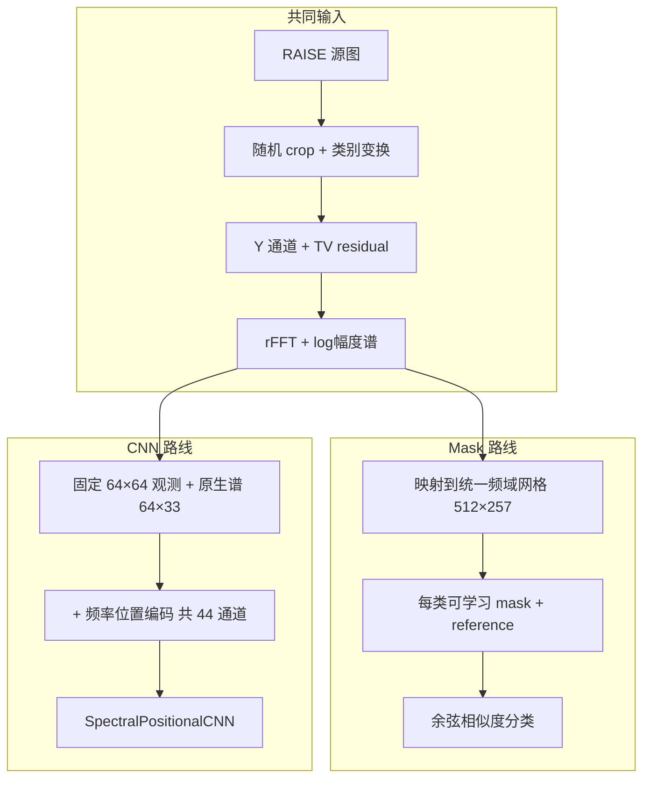

# 实验梳理与结果分析

> 更新日期：2026-06-17  
> 涵盖两条主线：**Mask**（`spectral-mask-resampling`）与 **CNN**（`spectral-history-cnn`）

---

## 一、项目总目标

核心问题：**能否从图像的频域痕迹，区分不同的处理历史**——尤其是 JPEG 压缩与下采样（×8、×16）在频谱上可能产生相似的 8/16 周期结构（即 Fourier ambiguity）。

数据基础：

- **RAISE-1K**（约 1000 张 TIFF）
- 按**源图**划分 train/val/test = **700 / 150 / 150**
- 每类每 split 生成大量随机 crop 样本

---

## 二、两条主线实验



| 维度 | **Mask** (`spectral-mask-resampling`) | **CNN** (`spectral-history-cnn`) |
|------|--------------------------------------|----------------------------------|
| 代码位置 | `spectral-mask-resampling/`（本地已有 outputs） | `CNN/spectral-history-cnn/` |
| 分类任务 | **4 类**：original / JPEG_Q80 / downsample×8 / downsample×16 | 已完成 **6 类**；配置已改为 **4 类**（结果待出） |
| 观测尺寸 | **多变**：128, 96, 64, 48, 32 | **固定**：最终 64×64 |
| 频谱尺寸 | 统一插值到 **512×257**（cycles/pixel 归一化网格） | 原生 **64×33** |
| 模型 | 每类一个 mask \(M_k\) + reference \(R_k\)，sigmoid mask 后与谱做 cosine similarity | 轻量 CNN + 正弦位置编码（λ=1,2,4,8,16,32） |
| 科学侧重 | JPEG vs ×8/×16 **歧义**（Fourier-only 能否分开） | 处理历史分类 + 混淆模式分析 |
| 结果文件 | `spectral-mask-resampling/outputs/v1_fourier_ambiguity_mask*/` | `CNN/spectral-history-cnn/outputs/metrics_test.json` 等 |
| 测试集规模 | **20000**（每类 5000，含 5 种观测尺寸） | **9000**（每类 1500，固定 64×64） |

---

## 三、Mask 路线：实验内容与结果

### 3.1 实验设计（`v1_fourier_ambiguity_mask`）

针对 `SUIVI.md` 里提到的 **resampling ambiguity**：

- 不同原始尺寸经不同路径，可能落到同一目标尺寸，频谱峰值位置相似
- Mask 路线用**频域重采样**（不是图像域放大）：把不同尺寸的 log-rFFT 谱映射到同一 **512×257** 归一化频率网格，再比较

每类生成方式（对每个观测尺寸 \(o\)）：

- `original`：直接裁 \(o \times o\)
- `JPEG_Q80`：裁 \(o \times o\) 后 JPEG Q=80
- `downsample_x8`：裁 \(8o \times 8o\) → resize 到 \(o\)
- `downsample_x16`：裁 \(16o \times 16o\) → resize 到 \(o\)

预处理流水线：

```text
RGB → Y 通道 → TV residual → rFFT2 → 垂直 fftshift
→ log(1 + |F|) → 映射到 512×257 归一化频率网格 → DC 抑制
→ 每类可学习 mask + reference → 余弦相似度分类
```

模型要点（`SpectralMaskClassifier`）：

- 每类一个可学习 mask \(M_k\)（sigmoid）和一个 reference 谱 \(R_k\)
- 对输入谱做 per-sample 归一化后，用 mask 加权，再与 reference 算 cosine similarity 得到 logits

### 3.2 三个变体对比（测试集 20000 样本）

结果目录：`spectral-mask-resampling/outputs/`

| 变体 | 总体准确率 | macro F1 | 推荐 |
|------|-----------|----------|------|
| **v1_fourier_ambiguity_mask_clean** | **56.6%** | **0.561** | ✅ 最佳 |
| `v1_fourier_ambiguity_mask` | 55.9% | 0.554 | 与 clean 接近 |
| `v1_fourier_ambiguity_mask_fast` | 41.6% | 0.380 | ❌ 退化 |

### 3.3 最佳变体分类指标（`v1_fourier_ambiguity_mask_clean`）

| 类别 | Precision | Recall | F1 | AUC (OvR) |
|------|-----------|--------|-----|-----------|
| original | 0.60 | 0.58 | **0.59** | 0.86 |
| JPEG_Q80 | 0.64 | 0.76 | **0.69** | 0.90 |
| downsample×8 | 0.48 | 0.42 | **0.45** | 0.78 |
| downsample×16 | 0.52 | 0.50 | **0.51** | 0.82 |

**按观测尺寸的准确率**（尺寸越小越难）：

| 观测尺寸 | 128 | 96 | 64 | 48 | 32 |
|----------|-----|-----|-----|-----|-----|
| accuracy | 63.3% | 60.9% | 56.9% | 54.2% | 47.6% |

### 3.4 关键混淆（clean 版，每类 support=5000）

| 混淆对 | 数量 | 结论 |
|--------|------|------|
| original → JPEG | 1515 | **最大错误**：未压缩与 JPEG 频谱相似 |
| JPEG → original | 833 | 双向混淆明显 |
| JPEG → ×8 | 298 | 中等 |
| JPEG → ×16 | 94 | 相对较少 |
| **×8 → ×16** | **1902** | **最严重**（占 ×8 样本 38%） |
| **×16 → ×8** | **1762** | **最严重**（占 ×16 样本 35%） |

混淆矩阵（行=真实，列=预测）：

```text
              pred_orig  pred_JPEG  pred_x8  pred_x16
true_orig        2900       1515      278       307
true_JPEG         833       3775      298        94
true_x8           611        365     2122      1902
true_x16          461        261     1762      2516
```

### 3.5 Mask 频带可分离性（早期 overlap 分析）

此前从 checkpoint 导出的 learned mask 分析显示，四类 mask 在频域上**高度重叠**（clean 版非对角 overlap 均值 0.936，fast 版≈0.999 塌缩）。这与分类结果一致：模型未能为各类划出独立频带。

### 3.6 Mask 结果分析

1. **总体准确率约 56%**，略高于随机（25%），但远低于 CNN 6 类实验的 62.5%（注意两者测试协议不同：Mask 含多尺寸、20000 样本）。
2. **核心瓶颈是 ×8 ↔ ×16**：两类互相误判合计 3664 例，印证 Fourier ambiguity——8 与 16 周期痕迹在频域难以区分。
3. **original ↔ JPEG 混淆显著**（1515+833）：Mask 路线下未压缩图与 JPEG 的频谱也比预期更接近。
4. **JPEG vs ×8/×16 并非完全分不清**：JPEG→×8 仅 298、JPEG→×16 仅 94，但 ×8/×16 之间混淆极严重。
5. **观测尺寸影响大**：128→32 准确率从 63.3% 降至 47.6%，小尺寸下频谱信息更少。
6. **fast 版明显退化**（41.6%）：大量 original 被误判为 JPEG（3038/5000），与 mask 塌缩现象一致。

这与 README 预期一致：即使准确率不高，**高 mask overlap + ×8/×16 混淆**本身就是有价值的结果——支持后续加 DCT 量化证据等混合方案（README Version 4）。

---

## 四、CNN 路线：实验内容与结果

### 4.1 实验设计（`v1_final64_poscnn`，6 类完整跑通）

- 输入：**最终观测到的 64×64** RGB patch（不做 512→64→512 往返）
- 各类 crop 源尺寸：original/JPEG=64，×2=128，×4=256，×8=512，×16=1024
- 预处理：Y 通道 → TV residual → rFFT → DC 抑制 → `log(1+|F|)`
- 模型：1 通道谱 + 43 通道位置编码 → `SpectralPositionalCNN`（共 44 通道输入）
- 训练：50 epoch，batch=256，AdamW lr=3e-4，RAISE 1000 张全量数据（test 9000 样本）

相关文件：

- 配置：`CNN/spectral-history-cnn/configs/v1_final64_poscnn_local.yaml`（已改为 4 类）
- 训练日志：`CNN/spectral-history-cnn/outputs/train_log.csv`
- 测试指标：`CNN/spectral-history-cnn/outputs/metrics_test.json`
- 预测明细：`CNN/spectral-history-cnn/outputs/predictions_test.csv`

### 4.2 测试集结果（9000 样本）

| 类别 | Precision | Recall | F1 | AUC (OvR) |
|------|-----------|--------|-----|-----------|
| original | 0.90 | 0.93 | **0.91** | 0.99 |
| JPEG | 0.92 | 0.89 | **0.91** | 0.99 |
| downsample×2 | 0.68 | 0.78 | **0.73** | 0.95 |
| downsample×4 | 0.44 | 0.38 | **0.41** | 0.77 |
| downsample×8 | 0.32 | 0.18 | **0.23** | 0.74 |
| downsample×16 | 0.41 | 0.58 | **0.48** | 0.83 |

- **总体准确率：62.5%**
- **最佳 val 在第 5 epoch**（65.2%），之后明显过拟合：最终 train_acc≈99.1%，val_acc≈62.7%

### 4.3 关键混淆（研究问题里最关心的几对）

| 混淆对 | 数量 / 1500 | 结论 |
|--------|------------|------|
| JPEG → ×8 | 15 | **很少**，JPEG 与 ×8 分得开 |
| JPEG → ×16 | 19 | **很少** |
| ×4 ↔ ×8 | 202 + 351 | **主要错误来源** |
| ×8 ↔ ×16 | 680 + 301 | **最严重**：×8 recall 仅 18.3% |
| original ↔ JPEG | 41 + 65 | 相对可控 |

### 4.4 CNN 结果分析

1. **「容易类」表现很好**：original 和 JPEG 的 F1≈0.91，AUC≈0.99——说明 TV residual + log 频谱对这两类有强判别力。
2. **真正难的是下采样因子区分**：×4/×8/×16 三者互相混淆严重，尤其 ×8 几乎被吸到 ×16（680 例）。这与 6 类设定下 ×8 频谱特征更接近 ×16 一致。
3. **与 Mask 路线的科学问题不完全重合**：6 类 CNN 里 JPEG vs ×8/×16 **不是**主要瓶颈；Mask 专注的 ambiguity 在 CNN 上反而表现较好。CNN 的弱点是**倍率细分**。
4. **过拟合明显**：应优先用 epoch 5 左右的 checkpoint，或加 early stopping / 更强正则。
5. **4 类实验已配置但未出结果**：`v1_final64_poscnn4` 已改为 4 类（去掉 ×2/×4），与 Mask 对齐；NPU 训练仍在进行或待完成。

---

## 五、两条路线的对比与启示

| 问题 | Mask（clean，4 类） | CNN（6 类，固定 64） |
|------|---------------------|----------------------|
| 总体准确率 | **56.6%** | **62.5%** |
| original / JPEG | F1≈0.59 / 0.69 | F1≈0.91 / 0.91 |
| ×8 / ×16 | F1≈0.45 / 0.51 | F1≈0.23 / 0.48 |
| JPEG vs ×8/×16 | JPEG→×8: 298，JPEG→×16: 94（中等） | JPEG→×8: 15，JPEG→×16: 19（很少） |
| ×8 ↔ ×16 | **1902 + 1762**（极严重） | 680 + 301（严重，但比例更低） |
| 观测尺寸 | 128→32 准确率 63%→48% | 仅 64×64 |
| 可解释性 | learned mask overlap 高 | saliency 可视化 |

**综合判断**：

- **Mask（56.6%）**：Fourier-only 可学习 mask 在 4 类歧义任务上仅略优于随机；**×8/×16 互相混淆是首要问题**，original/JPEG 次之。多尺寸设定使任务更难。
- **CNN（62.5%）**：深度模型在 original/JPEG 上远强于 Mask；6 类设定下主要瓶颈是 ×4/×8/×16 倍率细分，而非 JPEG ambiguity。
- 两条线**任务设定尚未完全对齐**（Mask=4 类+多尺寸+20000 样本，CNN=6 类+固定 64+9000 样本）。下一步应跑通 **4 类 CNN**，并在相同 4 类条件下公平对比。

---

## 六、其他相关工作（背景）

1. **`detect_resampling.py`**：论文 NFA 基线的二分类（RESAMPLED / NOT_RESAMPLED），rank residual + 谱相关。
2. **`data/protocol_dataset/`**：`a→c` vs `b→c` 歧义协议实验（不同 reference size 缩到同一 target）。
3. **`SUIVI.md`**：记录了从论文复现到 JPEG/×8/×16 歧义、CNN 方向的演进。
4. **`notes.md`**（项目根目录）：教授关于频谱特征、位置编码、DC 抑制的技术指导。

---

## 七、当前缺口与建议下一步

1. ~~补 Mask 分类指标~~ ✅ 已完成（`spectral-mask-resampling/outputs/*/metrics.json`）。
2. **跑完 4 类 CNN**（`v1_final64_poscnn4`），与 Mask 同任务对比。
3. **CNN early stopping**：用 val 最佳 epoch（≈5）而非 epoch 50。
4. **导出 Mask learned mask 可视化**到 outputs（`masks.npy`、`mask_overlap.npy`），便于与分类指标对照。
5. **报告里分开写两类结论**：
   - Mask：分类准确率 + 频带可分离性（mask overlap）+ per-size 分析
   - CNN：分类性能 + 混淆结构

---

## 八、关键文件索引

| 内容 | 路径 |
|------|------|
| Mask 最佳结果 | `spectral-mask-resampling/outputs/v1_fourier_ambiguity_mask_clean/metrics.json` |
| Mask 三变体 | `spectral-mask-resampling/outputs/v1_fourier_ambiguity_mask{,_clean,_fast}/` |
| Mask 预测明细 | `spectral-mask-resampling/outputs/v1_fourier_ambiguity_mask_clean/predictions_test.csv` |
| Mask zip 对比脚本 | `CNN/spectral-history-cnn/scripts/compare_mask_zip.py` |
| CNN 测试指标 | `CNN/spectral-history-cnn/outputs/metrics_test.json` |
| CNN 训练曲线 | `CNN/spectral-history-cnn/outputs/train_log.csv` |
| CNN 4 类配置 | `CNN/spectral-history-cnn/configs/v1_final64_poscnn_local.yaml` |
| 周报记录 | `SUIVI.md` |
| RAISE 数据 | `data/RAISE_1k.csv`，`spectral-mask-resampling/data/raw/raise_tiff/` |
