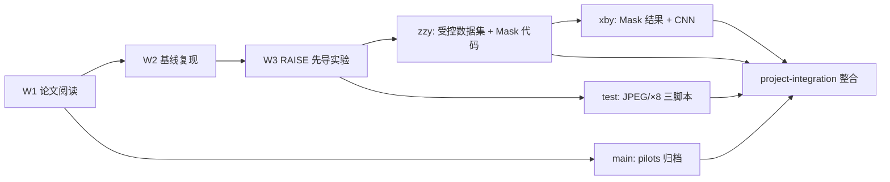
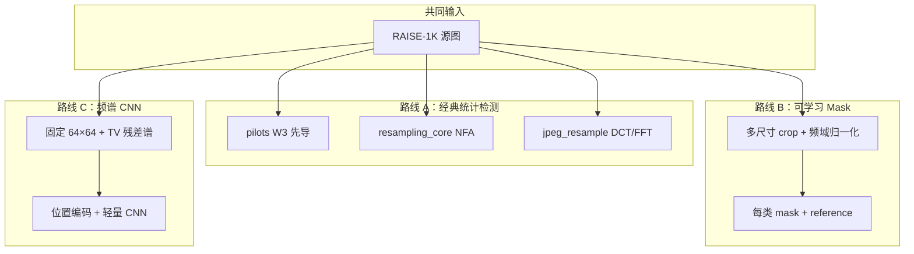

# 项目总览：原题、复现实验与主要发现

> 4IM06-G3-Project22 · 图像取证（Image Forensics）  
> 指导教师：Quentin Bammey · 整合分支：`project-integration`

---

## 1. 原项目是什么？

### 1.1 科学问题

数字图像在采集、编辑、AI 生成、压缩、上传过程中，常会经历：

- **几何重采样**（resize、插值上采样/下采样）
- **有损压缩**（尤其是 JPEG 的 8×8 块量化）

这两类操作都会在频域留下**周期性痕迹**，但周期位置可能相似：

| 现象 | 频域表现（宽度为 \(n\) 时） |
|------|---------------------------|
| JPEG 8×8 块效应 | 峰值常出现在 \(n/8,\, n/16,\, \ldots\) |
| ×8 下采样 | 可能产生 8 相关周期 |
| ×16 下采样 | 可能产生 16 相关周期 |

因此核心问题是：

> **能否从频域/残差域痕迹，区分「JPEG 压缩」「真实重采样」「不同下采样倍率」以及它们的组合？**

这就是 **Fourier ambiguity（频域歧义）**：不同处理历史映射到同一观测尺寸后，频谱峰值位置可能重叠，单靠峰值距离无法唯一反推处理历史。

### 1.2 参考方法：Bammey 等人的 NFA 重采样检测

论文：[Resampling Detection](https://bammey.com/resampling_detection.pdf)

基本思路（a contrario 框架）：

1. 对图像做 **TV 去噪** 得到平滑分量，取 **残差** \(I - \mathrm{TV}(I)\)
2. 对残差做 **2D FFT**，得到中心化频谱
3. 将频谱切成 patch，对每个候选距离 \(d\)，计算 patch 与平移后 patch 的 **复 Pearson 相关**
4. 统计每个 \(d\) 上有多少 patch 的局部相关最大 → 二项分布零假设 → **NFA（误报数）**
5. 若 \(\mathrm{NFA}(d) < \varepsilon\)，认为距离 \(d\) 显著 → 可能存在重采样

项目最初的三步规划（见 `SUIVI.md` W1）：

1. 检测是否重采样（二分类）
2. 估计重采样因子 / 原图尺寸
3. a contrario 统计判决

### 1.3 数据基础：RAISE-1K

- 约 **1000 张**真实相机 RAW（TIFF）
- 索引文件：`data/raise_raw/RAISE_1k.csv`（含 TIFF 下载 URL）
- 深度学习实验按**源图**划分：**700 / 150 / 150**（train / val / test），避免同一张原图的 crop 泄漏到不同 split

---

## 2. 我们做了什么？（时间线）

| 阶段 | 分支 / 目录 | 我们做了什么 |
|------|-------------|--------------|
| **W1–W2** | `main` | 阅读论文；实现 `resampling_core.py`；跑 `demo_resampling_detection.py` |
| **W3 先导** | `main` → `pilots/` | 10 张 RAISE 上 Idea1（JPEG/×8 混淆）+ Idea2（k 分组）；写 `REPORT.zh.md` |
| **受控 NFA** | `zzy` | RAISE100 bicubic 4500 图受控实验；候选原图尺寸估计；Mask 训练代码 |
| **JPEG/×8 管线** | `test` | 三脚本：数据集合成 → DCT/FFT 检测 → 批量评估 |
| **Mask 实验** | `xby` | 跑通 `v1_fourier_ambiguity_mask_clean`；20000 测试样本；8 张汇总图 |
| **CNN 实验** | `xby` | 6 类 `v1_final64_poscnn` 在 GPU 跑通；配置 4 类对齐 Mask |
| **整合** | `project-integration` | 合并四分支；归档冗余工具；统一文档与数据路径 |

更细的周报见 [`SUIVI.md`](../SUIVI.md)、[`REPORT.zh.md`](../REPORT.zh.md)。

---

## 3. 三条技术路线（当前仓库结构）

| 路线 | 文档 | 是否训练网络 | 我们的主要实验 |
|------|------|-------------|----------------|
| **A 经典检测** | [`01_classical_detection.md`](01_classical_detection.md) | 否 | W3 先导、RAISE100 受控、JPEG/×8 管线 |
| **B Mask** | [`02_spectral_mask.md`](02_spectral_mask.md) | 是（mask 参数） | `v1_fourier_ambiguity_mask_clean`，acc 56.6% |
| **C CNN** | [`03_spectral_cnn.md`](03_spectral_cnn.md) | 是 | 6 类 acc 62.5%；4 类配置已就绪 |

---

## 4. 复现实验与主要发现（按路线汇总）

### 4.1 经典路线：NFA 能否区分 JPEG 与重采样？

**实验（W3，`pilots/`，10 张 RAISE，目标尺寸 384×384）**

| 发现 | 数据支撑 |
|------|----------|
| **PNG 纯重采样不可分** | `png_identity` 与 `png_resample_to_target` 最佳峰距离 **10/10 完全相同**；显著率 0% |
| **JPEG 与「JPEG+重采样」聚合曲线一致** | `jpeg_q90_identity` ≈ `jpeg_q90_resample_to_target` |
| **k∈{-1,0,1} 相关模式无法区分** | 三类 prominence 差异仅 0.0003 |
| **检测对真实 RAISE 重采样不敏感** | 理论周期 128（512→384）未成为主导峰 |

**结论**：在投入大规模深度学习之前，应先弄清 NFA 基线对真实 RAISE 数据的敏感性；这直接推动了后续 Mask/CNN 路线，但任务定义更聚焦于 **4 类处理历史** 而非单纯二分类。

**实验（zzy，RAISE100 受控数据集，4500 目标图）**

- 每张图有已知 `source_size → target_size` 与 designed peak
- 批量跑 NFA + 候选尺寸排序
- 结果摘要：`test_results/controlled_resampling_dataset_bicubic_raise100/detection_summary.csv`

**实验（test，JPEG vs ×8 块重采样，2026-06-16）**

- 手工 DCT/FFT 特征 + a contrario，不依赖谱 patch 相关
- 完整闭环：合成数据集 → 单图检测 → 批量评估（结果需本地运行）

### 4.2 Mask 路线：Fourier-only 能否解开 4 类歧义？

**任务**：4 类 × 5 种观测尺寸（128→32），测试集 **20000** 样本。

| 指标 | 结果 |
|------|------|
| 准确率 | **56.6%**（随机 25%） |
| Macro F1 | **0.561** |
| 最强类 | JPEG F1=0.69 |
| 最弱类 | ×8 F1=0.45 |
| **核心瓶颈** | **×8 ↔ ×16**：互相误判 3664 例 |
| 可解释性 | learned mask 非对角 overlap 均值 **0.936** |

**结论**：可学习 mask 在 Fourier 归一化网格上**未能**为各类划出独立频带；**Fourier ambiguity 在 4 类任务中真实存在**，单靠 log 幅度谱 + mask 不够。

### 4.3 CNN 路线：深度模型能否做得更好？

**任务（已跑通）**：6 类，固定 64×64 观测，测试集 **9000** 样本。

| 指标 | 结果 |
|------|------|
| 准确率 | **62.5%** |
| original / JPEG | F1 ≈ **0.91**，AUC ≈ 0.99 |
| ×8 / ×16 | F1 ≈ **0.23 / 0.48** |
| 过拟合 | 最佳 val ≈ epoch 5（65.2%），最终 train_acc ≈ 99% |

**与 Mask 的对比启示**：

| 问题 | Mask（4 类，多尺寸） | CNN（6 类，固定 64） |
|------|----------------------|----------------------|
| JPEG vs ×8/×16 | 中等混淆 | **很少**（各约 15–19 例） |
| ×8 ↔ ×16 | **极严重** | 严重但比例更低 |
| original ↔ JPEG | 显著 | 相对可控 |

两条线**任务尚未完全对齐**（4 类 vs 6 类、多尺寸 vs 固定 64）。4 类 CNN（`v1_final64_poscnn4`）已配置，待训练完成后可做公平对比。

---

## 5. 综合结论与下一步

### 5.1 我们证明了什么？

1. **经典 NFA 在 RAISE 真实数据上对「纯几何重采样」不敏感**（W3 先导）。
2. **JPEG 与 ×8/×16 在频域确实可能重叠**，但程度因方法而异。
3. **Fourier-only mask 无法可靠解开 ×8/×16 歧义**（高 overlap + 高互相混淆）。
4. **CNN 在 original/JPEG 上远强于 mask**，但下采样倍率细分仍是难点。
5. **观测尺寸越小，分类越难**（Mask：128→32 从 63% 降至 48%）。

### 5.2 建议的下一步

1. 跑通 **4 类 CNN**，与 Mask 同任务公平对比
2. CNN 使用 **early stopping**（≈epoch 5）而非训练满 50 epoch
3. 探索 **混合特征**（Fourier + DCT 量化证据），论文 Version 4 方向
4. 经典 JPEG/×8 管线在更大数据集上出定量报告

---

## 6. 文档索引

| 文档 | 内容 |
|------|------|
| 本文 | 原题、时间线、发现汇总 |
| [`01_classical_detection.md`](01_classical_detection.md) | 经典检测：数据处理、算法、我们做的实验 |
| [`02_spectral_mask.md`](02_spectral_mask.md) | Mask 路线全流程与结果 |
| [`03_spectral_cnn.md`](03_spectral_cnn.md) | CNN 路线全流程与结果 |
| [`../EXPERIMENT_SUMMARY.md`](../EXPERIMENT_SUMMARY.md) | 实验数字速查 |
| [`../README.md`](../README.md) | 仓库入口与命令索引 |
