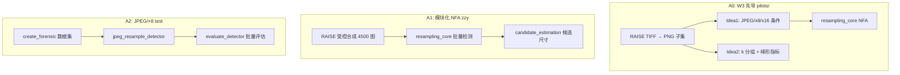
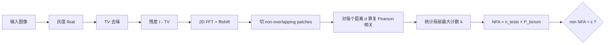
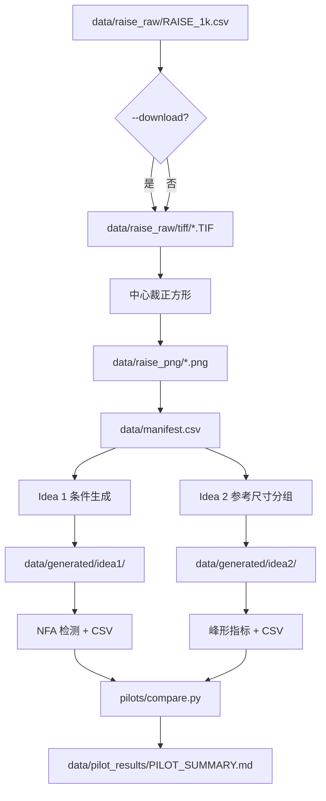
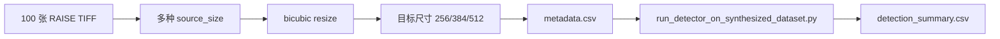
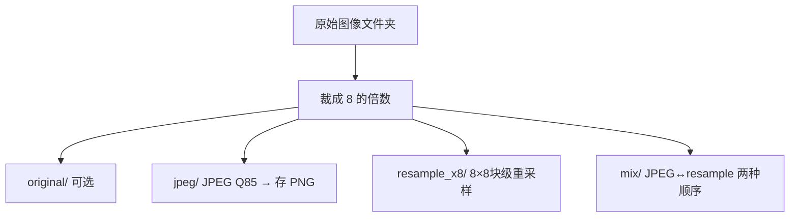
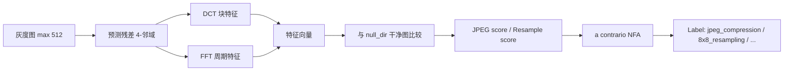

# 路线 A：经典统计检测方法详解

> 涵盖 `main`（W3 先导）、`zzy`（NFA 模块化 + 受控数据集）、`test`（JPEG vs ×8 三脚本）  
> 总览见 [`00_project_overview.md`](00_project_overview.md)

路线 A **不训练神经网络**，依赖手工特征 + 统计判决（a contrario NFA 或其变体）。

---

## 1. 路线 A 总览



| 子路线 | 入口 | 核心文件 |
|--------|------|----------|
| **A0** | `python run_pilots.py` | `pilots/`, `resampling_core.py` |
| **A1** | `demo_resampling_detection.py` / 受控合成脚本 | `resampling_core.py`, `candidate_estimation.py` |
| **A2** | `jpeg_resample_detector.py` | 三脚本闭环 |

---

## 2. 共用核心：`resampling_core.py`

### 2.1 算法流程



### 2.2 数据处理

| 步骤 | 实现 | 参数（默认） |
|------|------|-------------|
| 灰度化 | `rgb2gray` | 输入 RGB 或灰度 |
| TV 残差 | `denoise_tv_chambolle` | `weight=1.0` |
| 频谱 | `np.fft.fft2` + `fftshift` | 复数谱 |
| Patch | 非重叠切块 | 由 `patch_shape` 决定 |
| 距离 d | 沿某一轴平移 patch | `radius=3` 局部最大窗口 |
| NFA 阈值 | `epsilon` | 典型 1.0 |

### 2.3 输出

`DetectionResult` 包含：

- `distances[]`：候选距离
- `nfa[]`, `log10_nfa[]`
- `best_distance`：NFA 最小的 d

### 2.4 我们做了什么

- **W2**：实现并对 skimage camera 512→384 做 demo（`demo_resampling_detection.py`）
- **W3**：`pilots/metrics.py` 调用 `detect_axis()` 批量统计各条件下的 NFA 曲线
- **zzy**：`run_detector_on_synthesized_dataset.py` 对 4500 张受控图批量检测

---

## 3. A0：W3 先导实验（`pilots/`）

### 3.1 实验动机（SUIVI W3）

教授与组内讨论后确定两个 pilot 方向：

- **Idea 1**：JPEG / ×8 / ×16 周期是否混淆？（固定目标 384×384）
- **Idea 2**：相关模式中 k∈{-1,0,1} 哪组最强？峰形指标（prominence、半宽）能否辅助？

### 3.2 数据处理流水线



**`pilots/prepare_subset.py`**

- 从 RAISE 取前 N 张（我们跑了 **N=10**）
- TIFF → 中心裁方 → 灰度 PNG
- 写 `data/manifest.csv`

**`pilots/idea1_jpeg.py`** — 对每张源图生成多种条件（目标边长 384）：

| condition | 含义 |
|-----------|------|
| `png_identity` | PNG，仅 resize 到 384 |
| `png_resample_to_target` | 从大图 resize 到 384（模拟重采样到目标） |
| `png_sim_x8` | 模拟 ×8 栅格效应 |
| `jpeg_q90_identity` | JPEG Q90 后 resize |
| `jpeg_q90_resample_to_target` | JPEG + 重采样到目标 |
| `jpeg_q90_sim_x8` | JPEG + 栅格模拟 |

对每种条件调用 NFA，记录 best distance、@d=48、@d=128 等。

**`pilots/idea2_k_groups.py`** — 参考尺寸分组实验：

- 参考尺寸：64, 85, 96（对应 384 的 designed peaks）
- 对每组用 `ref_plus_k` 与 `target_minus_ref_plus_k` 公式生成 5 个源尺寸（k∈{-1,0,1} × offset）
- 记录 prominence、half-width、side ratio

### 3.3 我们跑出的结果（10 张 RAISE）

详见 [`data/pilot_results/PILOT_SUMMARY.md`](../data/pilot_results/PILOT_SUMMARY.md) 与 [`REPORT.zh.md`](../REPORT.zh.md)。

**关键数字：**

| 结论 | 证据 |
|------|------|
| PNG 重采样不可分 | 10/10 图 `png_identity` 与 `png_resample_to_target` 最佳 d 相同 |
| PNG NFA 不显著 | 显著率 0%，mean log10(NFA)=-1.19 |
| JPEG+重采样 ≈ 仅 JPEG | `jpeg_q90_*` 两组指标一致 |
| k 分组无效 | k=-1/0/1 prominence 差 0.0003 |
| 栅格模拟信号强但不稳 | `jpeg_q90_sim_x8` @d=48 均值 log10(NFA)≈-71，仅 1/10 图最佳峰在 d=48 |

**我们的判断**：暂缓大规模 CNN 数据集，先深化 Idea1 与受控合成对照。

### 3.4 如何复现

```bash
python run_pilots.py --max-images 10 --download
# 或分步：
python -m pilots.prepare_subset --max-images 10 --download
python -m pilots.idea1_jpeg
python -m pilots.idea2_k_groups
python -m pilots.compare
```

---

## 4. A1：模块化 NFA + 受控 RAISE 数据集（zzy）

### 4.1 候选原图尺寸估计

除「是否重采样」外，zzy 路线还研究：**给定目标尺寸 C 和检测到的峰 d，原图可能有哪些尺寸 N？**

`candidate_estimation.py` 枚举：

\[
N = k \cdot C + d \quad \text{或} \quad N = k \cdot C + (C - d)
\]

再按观测到的 NFA 支持度排序候选。

### 4.2 受控数据集设计

**`synthesize_controlled_resampling_dataset.py`**



| 参数 | 值 |
|------|-----|
| 图像数 | 100 RAISE |
| 目标尺寸 | 256, 384, 512 |
| 每目标 designed peaks | 3 组 |
| 每 peak 源尺寸数 | 5 |
| **总目标图** | 100×3×3×5 = **4500** |

Designed peak 示例（target=384）：96, 128, 160。

### 4.3 我们做了什么

- 实现完整合成 + 批量检测管线
- 入库轻量结果：`test_results/controlled_resampling_dataset_bicubic_raise100/`
  - `metadata.csv`：每张图的 source/target/designed_peak
  - `detection_summary.csv`：每张图垂直/水平 NFA 摘要

### 4.4 如何复现

```bash
python synthesize_controlled_resampling_dataset.py 100 --download
python run_detector_on_synthesized_dataset.py \
  test_results/controlled_resampling_dataset_bicubic_raise100/metadata.csv
```

单图 demo：

```bash
python demo_resampling_detection.py path/to/image.png
# 输出 NFA 曲线 CSV/图到 test_results/resampling_detection/
```

---

## 5. A2：JPEG vs ×8 块重采样（test，2026-06-16）

### 5.1 与 A0/A1 的区别

| 维度 | resampling_core (A0/A1) | jpeg_resample_detector (A2) |
|------|---------------------------|------------------------------|
| 特征 | 谱 patch 复相关 | DCT 块效应 + FFT 周期 |
| 目标 | 重采样峰 / 候选尺寸 | JPEG / ×8 / 混合 / 原图 四分类 |
| 零假设 | 二项 NFA on 相关计数 | 经验 null 分布（干净图或 surrogate） |

### 5.2 数据处理：`create_forensic_postprocess_dataset.py`



**×8 块级重采样**：不是普通 bicubic resize，而是 8×8 块内先缩再放（`inner_delta` ±1），模拟栅格周期性。

输出目录结构：

```text
dataset_x8/
  original/       # 可选
  jpeg/
  resample_x8/
  mix/            # jpeg_then_resample 或 resample_then_jpeg
```

### 5.3 检测：`jpeg_resample_detector.py`



**标签类型**：

- `jpeg_compression`
- `8x8_resampling`
- `jpeg_and_8x8_resampling`（及 dominant 变体）
- `original_or_uncertain`

### 5.4 评估：`evaluate_detector_on_dataset.py`

- 遍历 `dataset_x8/{split}/{class}/` 下图像
- 子进程调用 `jpeg_resample_detector.py`
- 映射到 4 类粗标签，打印准确率与混淆矩阵

### 5.5 我们做了什么

- 整合 test 分支最新三脚本（commit `ebf8a9c`）
- **尚未**在仓库中保存大规模定量结果（需本地生成 `dataset_x8` 后运行）
- 与 W3 Idea1 科学问题一致，但特征工程不同

### 5.6 如何复现

```bash
python create_forensic_postprocess_dataset.py \
  --input_dir path/to/raw_images \
  --output_dir dataset_x8 \
  --include_original --mix_order both

python jpeg_resample_detector.py \
  --image dataset_x8/jpeg/example.png \
  --null_dir dataset_x8/original

python evaluate_detector_on_dataset.py \
  --detector jpeg_resample_detector.py \
  --dataset_root dataset_x8 \
  --split test \
  --null_dir dataset_x8/train/original \
  --max_per_class 50
```

---

## 6. 归档工具（不主动使用）

早期 test 分支工具已移至 [`archive/legacy_test_tools/`](../archive/legacy_test_tools/)：

- `ResamplingDetector.py`：另一套自包含 NFA CLI
- `detect_resampling.py`：与 `resampling_core` 功能重叠的精简版
- `spai_detector_new.py`：手工特征 + Random Forest

---

## 7. 路线 A 小结

| 我们验证了什么 | 结果 |
|----------------|------|
| NFA 能否在 RAISE 上区分 PNG 重采样？ | **不能**（W3） |
| k 分组能否选最强相关模式？ | **不能**（W3） |
| 受控合成下 NFA 行为？ | 有完整 CSV 可分析（zzy） |
| DCT/FFT 能否区分 JPEG vs ×8？ | 管线已实现，待大规模评估（test） |

路线 A 的负结果直接推动了路线 B/C：**既然峰值距离 alone 不够，需要可学习表示或更丰富的特征（DCT、位置编码等）**。

---

## 新增：上采样 + 输入尺寸扫描

为与 B/C 两条路线一致地补齐「上采样」与「输入尺寸影响」，新增脚本
`scripts/analysis/classical_size_sweep.py`。它对每个观测（目标）尺寸 \(T\) **同时**
合成两个方向的样本：

- **下采样到 T**：source \(= T\cdot f\)（从更大图下采样）
- **上采样到 T**：source \(= T/f\)（从更小图上采样，即此前缺失的 upsampling）

随后跑 a-contrario 检测器，按 (尺寸, 方向) 统计「真源尺寸排到第 1 的比例」与最佳 NFA
峰的显著度中位数，回答尺寸是否影响经典检测。

```bash
cd 4IM06-G3-Project22
python scripts/analysis/classical_size_sweep.py \
  --image-dir spectral-mask-resampling/data/raw/raise_tiff \
  --limit-images 20 --target-sizes 256,384,512 --factors 2,4
```
输出 `test_results/classical_size_sweep/size_effect_summary.csv` 与 `size_effect.png`。
经典路线为 CPU 计算，可在 CPU 计算节点运行。

### 路线 A 的两个互补视角

经典路线用**两个检测器**作为互补代表，分别在不同任务上做上采样 + 尺寸扫描：

| 视角 | 检测器 | 任务 / 类别 | 上采样含义 | 尺寸扫描方式 |
|------|--------|-------------|-----------|--------------|
| A-1 NFA 尺寸恢复 | `resampling_core` + `run_controlled_resampling_experiments.py` | 估计源尺寸 / 是否重采样 | source < target（全局上采样到 T） | 扫目标尺寸 T（`classical_size_sweep.py`） |
| A-2 JPEG-vs-重采样 | `jpeg_resample_detector.py`（DCT-FFT a-contrario） | original/jpeg/resample_x8/mix | 全局 ×2/×4 上采样（新增类别 `upsample_xN`） | 扫 `--max_size`（`jpeg_detector_size_sweep.py`） |

A-2 的上采样实验：

```bash
# 1. 生成含上采样类别的取证后处理数据集
python create_forensic_postprocess_dataset.py \
  --input_dir <png_dir> --output_dir test_results/forensic_pp \
  --include_original --include_upsampling --mix_order both

# 2. 输入尺寸扫描（CPU）
python scripts/analysis/jpeg_detector_size_sweep.py \
  --dataset-root test_results/forensic_pp \
  --null-dir test_results/forensic_pp/original \
  --max-sizes 128,256,512
```

> 注意：`jpeg_resample_detector.py` 的 a-contrario 检验只针对 **period-8** 结构，没有原生"上采样"输出类别。因此 `upsample_xN` 样本会落到 `original_or_uncertain` / 重采样等类别——这一混淆本身就是要报告的结果（该检测器对全局上采样不敏感），与 Mask/CNN 的全局缩放任务形成对比。

### 提速：多核并行（保持结果一致）

路线 A 为纯 CPU 计算，已加入多进程并行，结果与单进程**逐位一致**（仅并行化任务划分，不改变检测逻辑/标签/计数）：

- `evaluate_detector_on_dataset.py`：改为**进程内**直接调用检测器（不再每张图起一个 `python` 子进程），null 经验分布**只构建一次**全程复用，并用 `--workers N` 在多核上并行评估（`0`=用满所有核，`1`=单进程）。新增 `--null_max_images` 控制 null 样本数。
- `run_controlled_resampling_experiments.py`：按**图像**并行（`--workers N`），各图像只写自己的子目录，汇总 `summary.csv` 由主进程按原顺序集中写出，因此与串行版本完全一致。
- `classical_size_sweep.py` / `jpeg_detector_size_sweep.py`：均新增 `--workers` 并透传给上面的脚本。

```bash
# NFA 尺寸扫描：每个目标尺寸内按图像多核并行
python scripts/analysis/classical_size_sweep.py \
  --image-dir spectral-mask-resampling/data/raw/raise_tiff \
  --limit-images 20 --target-sizes 256,384,512 --factors 2,4 --workers 0

# DCT-FFT 尺寸扫描：每个 max_size 内多核并行评估
python scripts/analysis/jpeg_detector_size_sweep.py \
  --dataset-root test_results/forensic_pp \
  --null-dir test_results/forensic_pp/original \
  --max-sizes 128,256,512 --workers 0
```

> NFA 并行用 `pool.map` 保序，源尺寸恢复率 / NFA 显著度等指标与单进程一致；评估器并行也保序（每张图的 `true/pred` 顺序不变），准确率与混淆矩阵不变。

### 三方法统一对比（同一张图）

三条路线的"原生任务"不同（经典 = period-8 / 源尺寸恢复；Mask/CNN = 6 类分类），无法用同一个 6 类准确率直接比。为此引入一个对三者都公平、且能在同一输入尺寸轴上计算的**共同二分类**：

> **「是否被几何重采样（上/下采样）」 vs 「原图」**（`original` 与仅 JPEG 压缩都算"未重采样"负类）。

- Mask / CNN：把各自每尺寸保存的 6×6 `confusion_matrix` 折叠为 {重采样 = `downsample_*`/`upsample_*`} vs {否 = `original`/`JPEG`}。
- 经典（A-2 DCT-FFT）：`evaluate_detector_on_dataset.py` 新增 `--json_out`，输出 `binary_resampling_accuracy`；`jpeg_detector_size_sweep.py` 每个 `max_size` 写一份 `eval_size{N}.json`。

```bash
cd 4IM06-G3-Project22
# 经典 A-2 在与 B/C 相同的尺寸轴上评估
python scripts/analysis/jpeg_detector_size_sweep.py \
  --dataset-root test_results/forensic_pp \
  --null-dir test_results/forensic_pp/original \
  --max-sizes 32,64,96,128 --workers 0
# 把三方法画到同一张图 + CSV
python scripts/analysis/unified_method_comparison.py --sizes 32,64,96,128
```
输出 `test_results/unified_comparison/unified_comparison.{csv,png}`：三条曲线（classical / mask / cnn）的"重采样检出"二分类准确率 vs 输入尺寸；Mask/CNN 的 6 类准确率作为附列保留。`summarize_size_effect.py` 仍提供 B/C 在完整 6 类上的同指标对比。

### 当前主协议 `n6`：一键经典管线

最终主线协议 `n6`（类别 original / JPEG_Q80 / ds×8 / ds×16 / up×4 / up×8，每尺寸单独评估）。经典路线用 `CLASS_SET=n6` 一键跑取证数据集 → DCT-FFT 尺寸扫描 →（可选）NFA 扫描 →（可选）三方法统一对比：

```bash
cd 4IM06-G3-Project22
CLASS_SET=n6 bash scripts/analysis/run_classical_pipeline.sh --detach
# 监控：tail -f test_results/classical_pipeline_logs/latest/pipeline.log
```

`CLASS_SET=n6` 会自动把上采样因子设为 `4,8`，并写入独立目录
`test_results/{forensic_pp_n6, jpeg_detector_size_sweep_n6, unified_comparison_n6}`，
与 `u6`/`u7` 结果互不覆盖。手动跑统一对比：

```bash
python scripts/analysis/unified_method_comparison.py --variant n6 --sizes 32,64,96,128
```

> 经典 A-2 的 `resample_x8` 是**分块**重采样，与 Mask/CNN 的全局缩放语义不同；三方法只在「是否重采样」这一二分类轴上严格可比。
