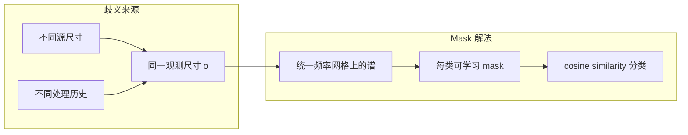
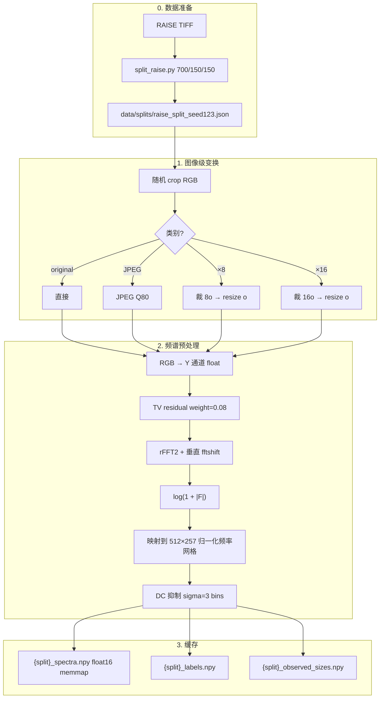
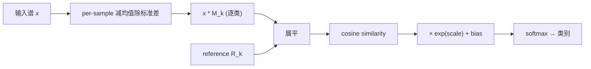

# 路线 B：Spectral Mask 方法详解

> 目录：`spectral-mask-resampling/`  
> **当前主协议：`n6`（原生谱 + 每尺寸单独训练，见 §9）**  
> 历史基线：`v1_fourier_ambiguity_mask_clean`（512×257 归一化频率网格，结果保留见 §1–§8）  
> 总览见 [`00_project_overview.md`](00_project_overview.md)

> 说明：本分支已收敛到 `n6` 协议，Mask 谱**只用原生 rFFT 分辨率**。§1–§8 记录的是 v1
> 历史实验（512×257 网格）及其结论，结果数据仍保留在 `outputs/`；其配置与
> 流水线脚本已移到归档分支 `archive/legacy-u6-u7`。

---

## 1. 要解决的问题

### 1.1 Fourier ambiguity（频域歧义）

不同处理路径可能产生**相同观测尺寸**的 patch，且频谱峰值位置相似：

```text
原图 A：裁 512×512 → resize 到 64×64
原图 B：裁 1024×1024 → resize 到 64×64   （×16 下采样路径）
```

两者最终都是 64×64，但处理历史不同（original vs downsample×16）。若只在**原生 64×64 频谱**上比较，峰值可能重叠。

### 1.2 Mask 路线的思路

1. 不把图像域放大到统一尺寸（避免引入新的插值痕迹）
2. 把 **log-rFFT 幅度谱** 映射到统一的 **归一化频率网格**（512×257，单位 cycles/pixel）
3. 为每个类别学习一个 **mask** \(M_k\) 和 **reference** \(R_k\)
4. 用 mask 加权后的谱与 reference 的 **余弦相似度** 分类



---

## 2. 分类任务定义

### 2.1 四类

| 类 index | 名称 | 生成方式（对观测尺寸 \(o\)） |
|----------|------|------------------------------|
| 0 | `original` | 从大图随机裁 \(o \times o\)，无压缩 |
| 1 | `JPEG_Q80` | 裁 \(o \times o\) → JPEG Q=80 |
| 2 | `downsample_x8` | 裁 \(8o \times 8o\) → bicubic resize 到 \(o\) |
| 3 | `downsample_x16` | 裁 \(16o \times 16o\) → bicubic resize 到 \(o\) |

### 2.2 五种观测尺寸

\(o \in \{128,\, 96,\, 64,\, 48,\, 32\}\)

同一张 RAISE 源图可对每个 \(o\) 和每类各采样多次。

### 2.3 数据规模（`v1_fourier_ambiguity_mask_clean`）

| Split | 源图数 | 每类每尺寸样本 | 总样本（约） |
|-------|--------|----------------|-------------|
| train | 700 | 1000 | 700×4×5×1000 = 14M（缓存为 memmap） |
| val | 150 | 1000 | 3M |
| test | 150 | 1000 | **20000**（4×5×1000） |

---

## 3. 数据处理流水线（逐步）



### 3.1 关键预处理参数

| 参数 | 值 | 说明 |
|------|-----|------|
| residual | TV | `tv_weight=0.08`, `max_iter=30` |
| 目标谱高 | 512 | 归一化频率轴行数 |
| 目标谱宽 | 257 | rFFT 半谱 + DC |
| DC 抑制 | `dc_sigma_bins=3.0` | 抑制低频主导 |
| 插值到网格 | 频域重采样 | **非**图像域 zoom |
| 缓存 dtype | float16 | 节省磁盘 |

实现文件：

- `src/data/preprocess_spectra.py`：批量生成 memmap
- `src/processing/residuals.py`：TV 残差
- `src/processing/spectrum.py`：`compute_log_rfft_spectrum` + 网格映射
- `src/processing/transforms.py`：JPEG、resize、crop

### 3.2 频域归一化网格的意义

不同观测尺寸 \(o\) 的原生 rFFT 尺寸不同（如 64×33 vs 128×65）。映射到同一 **cycles/pixel** 网格后，**相同物理频率**对齐到同一像素位置，使模型可以跨尺寸比较「处理历史」而非绝对像素频率。

---

## 4. 模型：SpectralMaskClassifier

### 4.1 结构

每类 \(k\) 有可学习参数：

- `mask_logits[k]` → \(M_k = \sigma(\text{logits})\)，形状 `[1, 512, 257]`
- `reference[k]`，形状 `[1, 512, 257]`
- `logit_scale[k]`, `class_bias[k]`：标量校准

### 4.2 前向计算



公式：

\[
\text{score}_k = \cos\bigl(\text{vec}(x \odot M_k),\, \text{vec}(R_k)\bigr)
\]

\[
\text{logit}_k = \text{score}_k \cdot e^{s_k} + b_k
\]

### 4.3 训练配置（`v1_fourier_ambiguity_mask_clean.yaml`）

| 参数 | 值 |
|------|-----|
| optimizer | AdamW, lr=1e-3 |
| batch_size | 64 |
| epochs | 30 |
| scheduler | cosine |
| save_best_by | val_loss |
| lambda_mask_l1 | 0（未加稀疏正则） |

实现：`src/train.py` → `src/models/spectral_mask_classifier.py`

---

## 5. 评估与可视化

### 5.1 评估脚本

v1 评估脚本已随配置移到归档分支 `archive/legacy-u6-u7`（`evaluate.py` + `visualize.py`）。

输出（保留在本分支）到 `outputs/v1_fourier_ambiguity_mask_clean/`：

- `metrics.json`
- `predictions_test.csv`
- `figures/confusion_matrix.png`
- `figures/masks/masks.npy`（本地，不入库）
- `figures/confusion_matrix_by_observed_size/*.png`

### 5.2 汇总图（我们额外生成）

`scripts/plot_mask_results.py` → `figures/summary/`：

| 图 | 内容 |
|----|------|
| `per_class_metrics.png` | 各类 F1 / AUC |
| `accuracy_by_size.png` | 128→32 准确率下降 |
| `confusion_matrix_normalized.png` | 行归一化混淆矩阵 |
| `key_confusion_pairs.png` | ×8↔×16 等关键误判 |
| `learned_masks.png` | 四类 mask 热力图 |
| `mask_overlap_heatmap.png` | mask 重叠矩阵 |
| `mean_spectra.png` | 各类平均 log 谱 |
| `prob_distribution_by_true_class.png` | 真类条件下预测概率箱线图 |

---

## 6. 我们的实验结果

### 6.1 总体指标

| 指标 | 数值 |
|------|------|
| **测试准确率** | **56.6%** |
| **Macro F1** | **0.561** |
| 随机基线（4 类） | 25% |
| 测试样本 | 20000 |

### 6.2 按类指标

| 类别 | F1 | AUC (OvR) |
|------|-----|-----------|
| original | 0.59 | 0.86 |
| JPEG_Q80 | **0.69** | 0.90 |
| downsample×8 | 0.45 | 0.78 |
| downsample×16 | 0.51 | 0.82 |

### 6.3 按观测尺寸

| 尺寸 | 128 | 96 | 64 | 48 | 32 |
|------|-----|-----|-----|-----|-----|
| accuracy | 63.3% | 60.9% | 56.9% | 54.2% | **47.6%** |

### 6.4 混淆矩阵（原始计数）

```text
              pred_orig  pred_JPEG  pred_x8  pred_x16
true_orig        2900       1515      278       307
true_JPEG         833       3775      298        94
true_x8           611        365     2122      1902
true_x16          461        261     1762      2516
```

### 6.5 我们得出的结论

1. **Fourier-only mask 优于随机，但远未解决 4 类问题**（56.6% vs 25%）。
2. **×8 ↔ ×16 是首要瓶颈**：3664 例互相误判（占两类样本约 35–38%）。
3. **original ↔ JPEG 次之**：1515+833 例双向混淆。
4. **JPEG vs ×8/×16 并非完全分不清**：JPEG→×8 仅 298 例。
5. **learned mask 高度重叠**（非对角 overlap 均值 **0.936**）→ 模型未能学到类专属频带。
6. **尺寸越小越难**：信息量减少，32×32 观测仅 47.6% 准确率。

这些结果支持假设：**仅靠归一化 log 幅度谱 + 线性 mask，不足以解开 ×8/×16 Fourier ambiguity**。

---

## 7. v1 历史复现说明

v1（512×257 归一化频率网格、4 类）的配置与流水线脚本已移到归档分支
`archive/legacy-u6-u7`；本分支只保留其结果数据 `outputs/v1_fourier_ambiguity_mask_clean/`，
可用 `python scripts/plot_mask_results.py` 从该结果重绘 summary 图。若要重跑 v1，请
`git checkout archive/legacy-u6-u7`。当前分支的可复现实验是 §9 的 `n6` 协议。

---

## 8. 文件索引（v1 历史结果）

| 类型 | 路径 |
|------|------|
| 结果 | `outputs/v1_fourier_ambiguity_mask_clean/` |
| 指标 | `outputs/.../metrics.json` |
| 图表 | `outputs/.../figures/summary/` |
| 子项目 README | [`../spectral-mask-resampling/README.md`](../spectral-mask-resampling/README.md) |

---

## 9. 当前主协议 `n6`：原生谱 + 每尺寸单独训练

为让三条路线在**完全一致的设定**下对比，当前主实验采用 `n6` 协议。相比 v1，它有两点关键变化：

- **类别**改为 6 类，并把上采样加进来（与 CNN 路线一致）：
  `original / JPEG_Q80 / downsample_x8 / downsample_x16 / upsample_x4 / upsample_x8`。
- **Mask 谱输入**不再统一到 512×257 网格，而是保留**原生** rFFT 分辨率 \((o,\,o/2{+}1)\)。

**为什么 Mask 可以用原生谱**：512×257 网格的存在意义，是让**同一个模型**比较不同观测尺寸 \(o\) 的「相同物理频率」。既然 `n6` 对每个 \(o\) **单独训练**，模型只需面对单一尺寸，谱网格无需对齐——直接用原生 rFFT 即可，从而与 CNN 路线（一向用原生 \(o\times(o/2{+}1)\) 谱）的输入表示**对齐**，使两条可学习路线真正可比。

### 9.1 统一 6 类（含更强上采样）

| index | 名称 | 生成方式（观测尺寸 \(o\)） | 源裁切 |
|-------|------|---------------------------|--------|
| 0 | `original` | 裁 \(o\) | \(o\) |
| 1 | `JPEG_Q80` | 裁 \(o\) → JPEG Q80 | \(o\) |
| 2 | `downsample_x8` | 裁 \(8o\) → resize \(o\) | \(8o\) |
| 3 | `downsample_x16` | 裁 \(16o\) → resize \(o\) | \(16o\) |
| 4 | `upsample_x4` | 裁 \(o/4\) → resize \(o\) | \(o/4\) |
| 5 | `upsample_x8` | 裁 \(o/8\) → resize \(o\) | \(o/8\) |

> `upsample_x8` 在 \(o=32\) 时源裁切 = 4px，正好等于最小裁切下限 `MIN_UPSAMPLE_CROP=4`。

### 9.2 原生谱的代码

| 文件 | 说明 |
|------|------|
| `src/processing/spectrum.py` | `compute_log_rfft_spectrum(residual, dc_sigma_bins)`：rFFT2 → 垂直 fftshift → **在原生复数谱上做 DC 抑制** → `log1p(abs(F))`，返回原生 \((1,o,o/2{+}1)\) 谱。与 CNN 路线 `compute_log_rfft_spectrum` **逐位一致**（同一 `build_dc_weight`、同样的 DC-先于-log 顺序），两条路线吃完全相同的谱表示 |
| `src/data/preprocess_spectra.py` | 强制**单一观测尺寸**，缓存谱 shape = \((N,1,o,o/2{+}1)\) |
| `scripts/run_prepare_config.sh` | 从 config 读 `data_dir / class_names / observed_sizes`，谱恒为原生分辨率 |

> 注：DC 抑制现在作用在**复数谱** \(F\) 上（`F = F · dc_weight`），再取 `log1p(|F|)`；
> 这与 CNN 完全一致。之前 Mask 是先 `log1p(|F|)` 再乘权重（顺序相反），现已统一。

`src/train.py` / `src/evaluate.py` 按 config 的 `spectrum.height/width_rfft` 建模型。各尺寸原生谱形状：

| \(o\) | 32 | 64 | 96 | 128 |
|------|-----|-----|-----|-----|
| 谱 \((H, W_{rfft})\) | (32, 17) | (64, 33) | (96, 49) | (128, 65) |

> 提速：谱缓存生成按 **(观测尺寸, 类别)** 分块用 `--workers N` 多进程并行（`0`=用满所有核）。每个 worker 只写 memmap 中自己那段不重叠的行，无需加锁；每块用**与 worker 数无关**的确定性种子，因此谱/标签/尺寸数组**与并行度无关、逐位一致**。`run_prepare_config.sh` 透传 `PREP_WORKERS`（默认 `0`）。

### 9.3 配置与运行

配置：`configs/size_sweep/n6_mask_size{32,64,96,128}.yaml`（独立缓存
`data/processed/n6_mask_size*`、输出到项目级 `results/mask/n6_mask_size*`）。

```bash
cd spectral-mask-resampling

# 单尺寸完整管线（prepare→train→eval→viz）
CONFIG=configs/size_sweep/n6_mask_size64.yaml bash scripts/run_pipeline_config.sh

# 交互节点顺序跑全部尺寸
bash scripts/run_size_sweep.sh

# 集群 NPU：每个尺寸一个 vc 作业（需把 scripts/vc_mask.sh 复制到 $CODES，
# 并把其中 `vc submit` 行从 vc_cnn_spectral_v1.sh 拷过来）
SIZES="32 64 96 128" bash scripts/submit_size_sweep_npu.sh

# 本地冒烟（验证缓存谱 shape = (N,1,o,o/2+1)）
LIMIT_IMAGES=4 SAMPLES_PER_CLASS_PER_SIZE=8 \
  CONFIG=configs/size_sweep/n6_mask_size64.yaml bash scripts/run_pipeline_config.sh
```

### 9.4 汇总

```bash
cd ..
python scripts/analysis/summarize_size_effect.py
```
输出 `results/comparison/size_effect/`（Mask vs CNN 在 `n6` 6 类上的准确率-尺寸曲线）。
