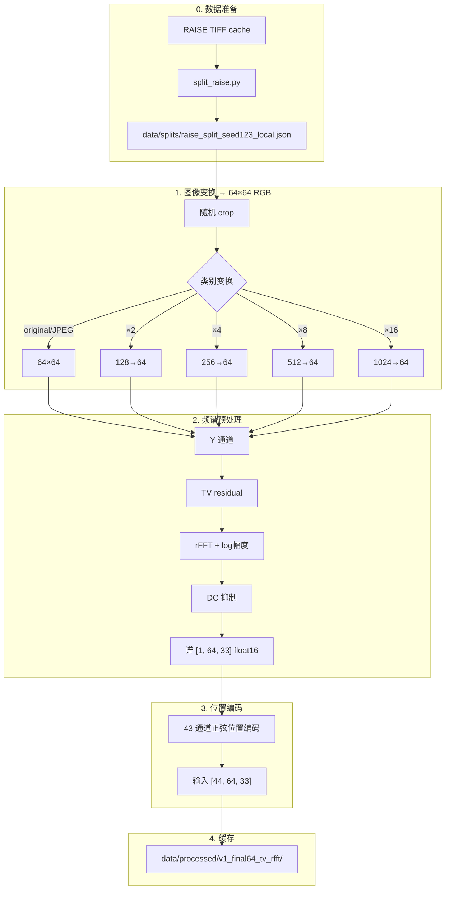
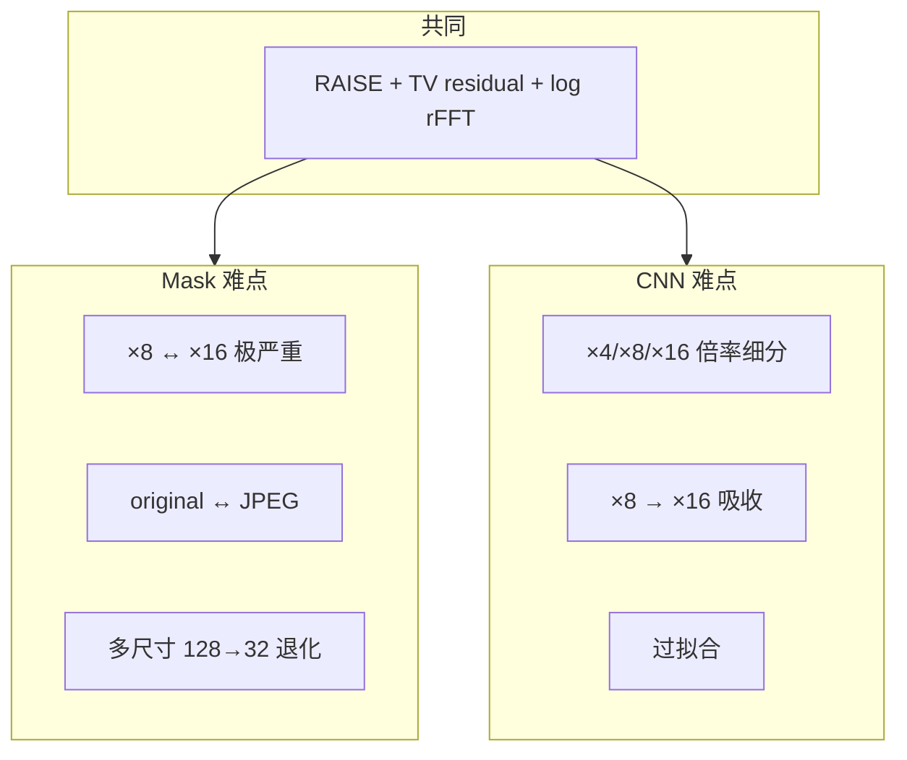

# 路线 C：Spectral CNN 方法详解

> 目录：`CNN/spectral-history-cnn/`  
> 已完成实验：`v1_final64_poscnn`（6 类）  
> 待完成：`v1_final64_poscnn4`（4 类，与 Mask 对齐）  
> 总览见 [`00_project_overview.md`](00_project_overview.md)

---

## 1. 要解决的问题

与 Mask 路线相同的宏观目标：**从频域痕迹判断图像的处理历史**。

CNN 路线的差异：

| 维度 | Mask | CNN |
|------|------|-----|
| 观测尺寸 | 多种 \(o\) | **固定**最终 64×64 |
| 频谱表示 | 插值到 512×257 网格 | **原生** 64×33 rFFT |
| 分类器 | 每类 mask + cosine | **卷积网络** + 位置编码 |
| 类数（已跑通） | 4 | **6**（含 ×2、×4） |

CNN 更擅长 **original / JPEG**；主要瓶颈是 **下采样倍率细分**（×4/×8/×16 互混），而非 Mask 最突出的 JPEG-vs-×8/×16 歧义。

---

## 2. 分类任务定义

### 2.1 六类（`v1_final64_poscnn`，已跑通）

| 类 | 名称 | 裁切源尺寸 → 最终 64×64 |
|----|------|-------------------------|
| 0 | original | 64×64 直接 |
| 1 | JPEG | 64×64 → JPEG Q80 |
| 2 | downsample×2 | 128×128 → resize 64 |
| 3 | downsample×4 | 256×256 → resize 64 |
| 4 | downsample×8 | 512×512 → resize 64 |
| 5 | downsample×16 | 1024×1024 → resize 64 |

### 2.2 四类（`v1_final64_poscnn4`，配置已就绪）

与 Mask 对齐：original / JPEG / downsample×8 / downsample×16，去掉 ×2、×4。

配置文件：`configs/v1_final64_poscnn_local.yaml`

### 2.3 数据规模（6 类实验）

| Split | 源图 | 每类样本 | 总样本 |
|-------|------|----------|--------|
| train | 700 | 7000 | 42000 |
| val | 150 | 1500 | 9000 |
| test | 150 | 1500 | **9000** |

---

## 3. 数据处理流水线



### 3.1 与 Mask 预处理的关键区别

| 步骤 | Mask | CNN |
|------|------|-----|
| 最终图像尺寸 | 多种 \(o\) | 恒为 64×64 |
| 频谱尺寸 | 512×257（插值网格） | **64×33**（原生） |
| 位置信息 | 隐含在统一网格 | **显式** 43 通道编码 |

### 3.2 位置编码（`positional_encoding.py`）

在 log 谱上拼接频率坐标特征，λ ∈ {1, 2, 4, 8, 16, 32}：

- 基础坐标：\(U, V, r, \cos\theta, \sin\theta\)
- 正弦带：\(\sin(2\pi f/\lambda),\ \cos(2\pi f/\lambda)\) 等

总输入通道：**1（谱）+ 43（编码）= 44**

目的：让 CNN 知道每个谱系数在**归一化频率平面**上的位置，区分「周期出现在哪」。

### 3.3 预处理参数

| 参数 | 值 |
|------|-----|
| residual | TV, weight=0.08 |
| dc_sigma_bins | 3.0 |
| jpeg_quality | 80 |
| interpolation | bicubic |
| cache_dtype | float16 |

实现：`src/data/preprocess_spectra.py`（CNN 版，无频域网格插值）

---

## 4. 模型：SpectralPositionalCNN

### 4.1 结构


- 3 个 ConvBlock（每块 2×Conv-BN-GELU）
- 3 次 MaxPool
- Global Average Pooling + Dropout(0.2) + 线性分类头

实现：`src/models/spectral_positional_cnn.py`

### 4.2 训练配置（6 类实验）

| 参数 | 值 |
|------|-----|
| optimizer | AdamW, lr=3e-4 |
| batch_size | 256 |
| epochs | 50 |
| scheduler | cosine |
| AMP | true |
| save_best_by | val_loss |
| device | CUDA（HPC GPU） |

---

## 5. 我们的实验结果（6 类，`v1_final64_poscnn`）

### 5.1 总体指标

| 指标 | 数值 |
|------|------|
| **测试准确率** | **62.5%** |
| 测试样本 | 9000 |
| 最佳 val 准确率 | **65.2%**（约 epoch 5） |
| 最终 train 准确率 | ~99.1%（明显过拟合） |

### 5.2 按类指标

| 类别 | Precision | Recall | F1 | AUC |
|------|-----------|--------|-----|-----|
| original | 0.90 | 0.93 | **0.91** | 0.99 |
| JPEG | 0.92 | 0.89 | **0.91** | 0.99 |
| downsample×2 | 0.68 | 0.78 | 0.73 | 0.95 |
| downsample×4 | 0.44 | 0.38 | 0.41 | 0.77 |
| downsample×8 | 0.32 | 0.18 | **0.23** | 0.74 |
| downsample×16 | 0.41 | 0.58 | 0.48 | 0.83 |

### 5.3 关键混淆（每类 1500 测试样本）

| 混淆对 | 数量 | 解读 |
|--------|------|------|
| JPEG → ×8 | 15 | **很少** |
| JPEG → ×16 | 19 | **很少** |
| ×8 → ×16 | **680** | ×8 recall 仅 18.3% |
| ×16 → ×8 | 301 | |
| ×4 ↔ ×8 | 202 + 351 | 倍率相邻混淆 |
| original ↔ JPEG | 41 + 65 | 相对可控 |

### 5.4 训练曲线观察

- **Epoch 5 左右** val_loss 最低、val_acc 最高
- 之后 train 持续上升、val 停滞 → 应使用 early stopping
- 日志：`outputs/train_log.csv`

### 5.5 我们得出的结论

1. **TV residual + log 频谱对 original/JPEG 极强**（F1≈0.91）— 远超 Mask 同类表现。
2. **CNN 在 JPEG vs ×8/×16 上很少混淆** — 与 Mask 形成鲜明对比。
3. **真正难的是下采样倍率区分**：×8 几乎被吸向 ×16。
4. **6 类设定使任务与 Mask 4 类不完全可比**；需跑 4 类版公平对比。
5. **过拟合严重**；报告指标应基于 best checkpoint（≈epoch 5）。

---

## 6. 与 Mask 路线的对比



| 问题 | Mask (4类, 多尺寸) | CNN (6类, 固定64) |
|------|-------------------|-------------------|
| 准确率 | 56.6% | 62.5% |
| original/JPEG F1 | 0.59 / 0.69 | **0.91 / 0.91** |
| ×8 F1 | 0.45 | 0.23 |
| ×16 F1 | 0.51 | 0.48 |
| JPEG→×8/×16 | 中等 | **极少** |
| ×8↔×16 | **极严重** | 严重 |

**科学含义**：两条线揭示了**不同层面的困难** — Mask 专攻的 Fourier ambiguity 在 CNN 的 6 类设定下不是主瓶颈；CNN 的主瓶颈是**倍率分辨率**。

---

## 7. 输出文件

### 7.1 已入库（git）

```text
CNN/spectral-history-cnn/outputs/
  metrics_test.json          # 6 类测试指标
  predictions_test.csv
  train_log.csv
  v1_final64_poscnn/
    metrics_test.json
    figures/
      confusion_matrix.png
      train_curves.png
      example_spectra_per_class/*.png
      mean_spectrum_per_class/*.png
      saliency_original.png
```

### 7.2 本地生成（不入库）

- `checkpoints/best.pt`
- `data/processed/` memmap 缓存

---

## 8. 完整复现命令

```bash
cd CNN/spectral-history-cnn

# 全流水线（需 GPU + RAISE TIFF）
bash scripts/run_v1_pipeline_full.sh

# 或分步：
bash scripts/run_v1_prepare_local.sh   # 预处理
bash scripts/run_v1_train.sh           # 训练
bash scripts/run_v1_eval.sh            # 评估
```

4 类实验（与 Mask 对齐，待跑）：

```bash
# 使用 v1_final64_poscnn_local.yaml → outputs/v1_final64_poscnn4
bash scripts/run_v1_train.sh  # 需指定对应 config
```

---

## 9. 文件索引

| 类型 | 路径 |
|------|------|
| 6 类配置 | `configs/v1_final64_poscnn.yaml` |
| 4 类配置 | `configs/v1_final64_poscnn_local.yaml` |
| 测试指标 | `outputs/v1_final64_poscnn/metrics_test.json` |
| 子项目 README | [`../CNN/spectral-history-cnn/README.md`](../CNN/spectral-history-cnn/README.md) |
