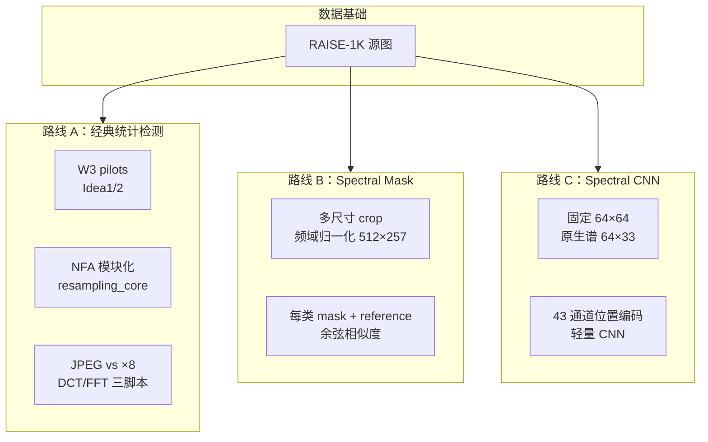
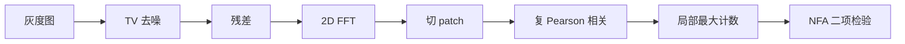
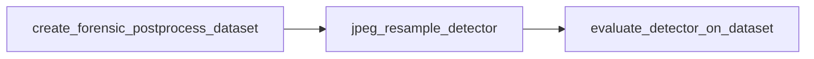
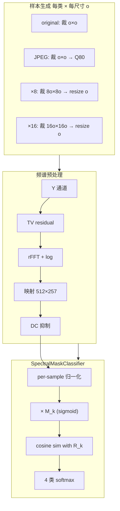
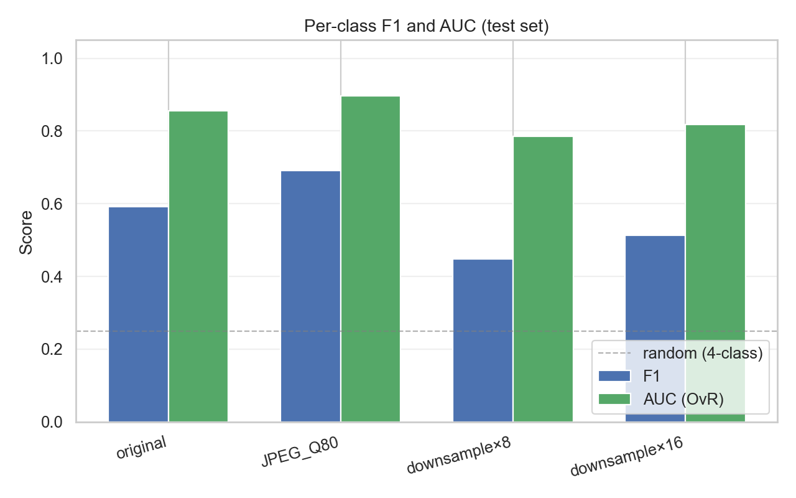
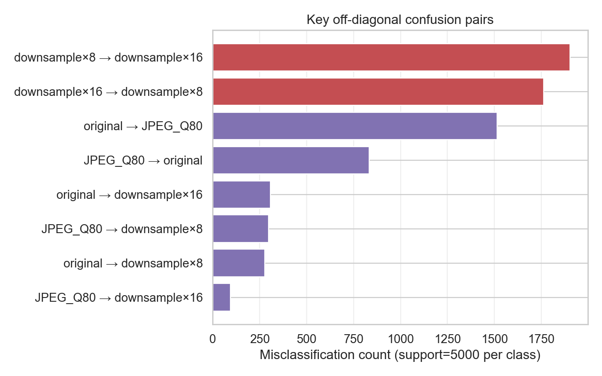
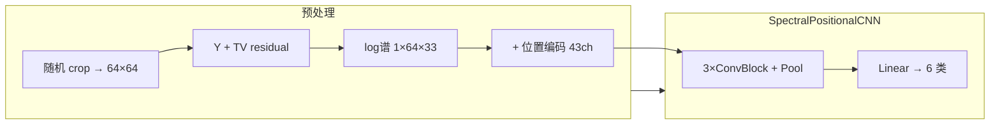
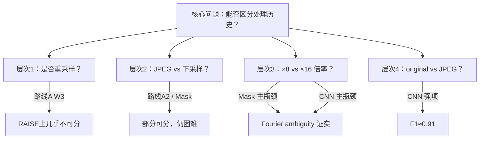

# 4IM06-G3-Project22 总体实验报告

**课程**：Telecom Paris IM06 · 图像取证（Image Forensics）  
**指导教师**：Quentin Bammey  
**项目主题**：从频域痕迹区分 JPEG 压缩、几何重采样与处理历史  
**数据**：[RAISE-1K](https://loki.disi.unitn.it/RAISE/download.html)（约 1000 张真实相机 TIFF）  
**报告日期**：2026 年 6 月  
**代码分支**：`project-integration`

---

## 摘要

本项目围绕 **Fourier ambiguity（频域歧义）** 展开：JPEG 8×8 块效应与 ×8/×16 下采样均可在频谱中引入相似的 8/16 周期结构，不同处理历史经不同路径映射到同一观测尺寸后，峰值位置可能重叠，难以仅凭距离 \(d\) 区分处理类型。

我们沿三条互补路线推进：

1. **经典统计检测**（谱相关 + a contrario NFA；DCT/FFT 特征）：复现论文基线，在 RAISE 上完成 W3 先导实验与受控合成数据集实验。
2. **可学习 Spectral Mask**：将 log-rFFT 谱映射到统一归一化频率网格，为每类学习 mask/reference，在 4 类 × 5 观测尺寸任务上测试准确率 **56.6%**。
3. **Spectral CNN**：TV 残差谱 + 频率位置编码 + 轻量 CNN，6 类固定 64×64 任务准确率 **62.5%**，original/JPEG F1 达 **0.91**。

**主要结论**：（1）经典 NFA 在 RAISE 真实数据上对纯 PNG 几何重采样**几乎不敏感**；（2）Fourier-only mask **未能**为 ×8/×16 划出独立频带（mask overlap 0.936，×8↔×16 误判 3664 例）；（3）CNN 在 original/JPEG 上远强于 mask，但下采样倍率细分仍是瓶颈；（4）观测尺寸越小，分类越难（128→32 准确率从 63% 降至 48%）。

**建议下一步**：跑通与 Mask 对齐的 4 类 CNN 公平对比；CNN early stopping；探索 Fourier + DCT 混合特征。

---

## 1. 引言

### 1.1 研究背景

数字图像在传播链路中常经历 resize、JPEG 压缩、AI 生成后处理等操作。取证领域关心的问题是：**能否从图像内部痕迹反推其处理历史？**

Bammey 等人提出的重采样检测方法基于：

- 对图像取 **TV 残差**，削弱平滑内容与强边缘；
- 在傅里叶域检测 **谱 patch 的周期性相关**；
- 用 **a contrario NFA** 控制误报，判断是否存在显著周期。

然而真实场景更复杂：

| 痕迹来源 | 典型周期（图像宽 \(n\)） |
|----------|-------------------------|
| JPEG 8×8 量化 | \(n/8,\, n/16,\, \ldots\) |
| ×8 下采样 | 8 相关结构 |
| ×16 下采样 | 16 相关结构 |

当不同处理历史产生**相同或相近的峰值位置**时，即出现 **Fourier ambiguity**——这正是本项目的核心科学问题。

### 1.2 项目目标（W1 确立）

1. **检测**是否经过重采样（二分类）
2. **估计**重采样因子 / 候选原图尺寸
3. 基于 **a contrario** 的统计可靠性分析

随研究深入，目标演进为：

> 在控制观测尺寸的条件下，区分 **original / JPEG / downsample×8 / downsample×16** 四类处理历史，并量化 Fourier-only 方法的极限。

### 1.3 数据与划分

- **RAISE-1K**：1000 张高质量 TIFF，索引见 `data/raise_raw/RAISE_1k.csv`
- **深度学习实验**：按源图划分 train / val / test = **700 / 150 / 150**，避免数据泄漏
- **经典先导**：W3 使用 10 张 RAISE 子集；zzy 受控实验使用 100 张

---

## 2. 技术路线总览



| 路线 | 是否训练网络 | 核心思想 | 详细文档 |
|------|-------------|----------|----------|
| A 经典检测 | 否 | NFA / DCT 统计判决 | [`01_classical_detection.md`](01_classical_detection.md) |
| B Mask | 是（mask 参数） | 统一频率网格 + 可解释频带 | [`02_spectral_mask.md`](02_spectral_mask.md) |
| C CNN | 是 | 位置编码 + 卷积表征 | [`03_spectral_cnn.md`](03_spectral_cnn.md) |

---

## 3. 路线 A：经典统计检测

### 3.1 共用算法：谱相关 + NFA



实现：`resampling_core.py`（论文 clean-room 复现）

### 3.2 实验 A0：W3 RAISE 先导（10 张图）

**动机**（SUIVI W3）：在投入深度学习前，先验证 NFA 能否区分 JPEG 与重采样；测试 k∈{-1,0,1} 相关模式。

**数据处理**：

```text
RAISE TIFF → 中心裁方 PNG → 生成 7 种条件（384×384）
  → TV 残差 → NFA 曲线 → CSV 汇总
```

**我们的结果**（`data/pilot_results/PILOT_SUMMARY.md`）：

| 发现 | 证据 |
|------|------|
| PNG 重采样不可分 | 10/10 图 `png_identity` 与 `png_resample_to_target` 最佳峰 **d 相同** |
| PNG NFA 不显著 | 显著率 0%，mean log10(NFA) = −1.19 |
| JPEG ≈ JPEG+重采样 | `jpeg_q90_identity` 与 `jpeg_q90_resample_to_target` 指标一致 |
| k 分组无效 | k=−1/0/1 prominence 差 **0.0003** |
| 理论峰 128 未主导 | 512→384 时期望 d=128，平均 @d=128 的 log10(NFA)=2.29（不显著） |

**解读**：NFA 基线在 RAISE 真实数据上对「纯几何重采样」**不敏感**；不宜在未验证基线前盲目构建大规模 CNN 数据集。完整 W3 分析见 [`REPORT.zh.md`](../REPORT.zh.md)。

### 3.3 实验 A1：RAISE100 受控数据集（4500 图）

**设计**：100 张 RAISE × 3 目标尺寸 × 3 designed peaks × 5 源尺寸，bicubic 合成，每张图 ground truth 已知。

**我们做了什么**：

- 实现 `synthesize_controlled_resampling_dataset.py` + `run_detector_on_synthesized_dataset.py`
- 实现 `candidate_estimation.py`：由峰距离 \(d\) 枚举候选原图尺寸 \(N = kC \pm d\)
- 入库 `test_results/controlled_resampling_dataset_bicubic_raise100/detection_summary.csv`

**候选尺寸估计结果**（补充实验 E4，`scripts/analysis/e4_nfa_candidate_topk.py`，N=9000 行）：

| 指标 | vertical | horizontal | 合计 |
|------|----------|------------|------|
| top-1 命中率（`true_rank`=1） | 11.1% | 11.1% | **11.1%** |
| top-3 命中率（`true_rank`≤3） | 37.2% | 37.8% | **37.5%** |
| `best_distance` = `designed_peak` | 22.9% | 23.6% | **23.3%** |
| 显著检测率（`best_nfa` < 1） | 89.3% | 92.7% | **91.0%** |
| 无有效排名（`true_rank` 空） | 59.0% | 58.0% | **58.5%** |

**解读**：在**已知 ground truth** 的受控合成集上，NFA **经常能检出显著周期峰**（91%），但 **top-1 候选尺寸命中率仅 11%**——与 W3 真实 RAISE 上「峰不可分」形成对照：问题不仅是「检不出」，更是「检出了也定不准」。

**价值**：在**已知真值**的合成数据上评估 NFA 行为，与 W3 真实 RAISE 结论对照。

### 3.4 实验 A2：JPEG vs ×8 块重采样（test 分支）

**与 A0/A1 的区别**：不用谱 patch 相关，而用 **DCT 块效应 + FFT 周期** 特征 + 经验零假设分布。

**三脚本闭环**：



| 脚本 | 功能 |
|------|------|
| `create_forensic_postprocess_dataset.py` | 生成 original / jpeg / resample_x8 / mix |
| `jpeg_resample_detector.py` | 输出 Label（jpeg / 8x8_resampling / mixed / uncertain） |
| `evaluate_detector_on_dataset.py` | 批量准确率 + 混淆矩阵 |

**状态**：管线已整合入库；大规模定量结果需本地生成 `dataset_x8` 后运行。

### 3.5 路线 A 小结

经典路线提供了**重要的负结果**：峰值距离 alone 在 RAISE 上不足以区分处理历史。这直接推动了路线 B/C 的任务重定义——从「是否重采样」转向「四类处理历史分类」，并探索可学习表示。

---

## 4. 路线 B：Spectral Mask

### 4.1 方法设计

**核心思想**：不同观测尺寸 \(o\) 的 patch，其原生 rFFT 尺寸不同；通过 **频域重采样**（非图像域放大）将 log 幅度谱映射到统一 **512×257** 归一化频率网格（cycles/pixel），使「相同物理频率」对齐，再比较处理历史。



**观测尺寸**：128, 96, 64, 48, 32  
**实验版本**：`v1_fourier_ambiguity_mask_clean`（唯一保留）

### 4.2 我们的实验

| 项目 | 设置 |
|------|------|
| 训练源图 | 700 |
| 测试源图 | 150 |
| 测试样本 | **20000**（4 类 × 5 尺寸 × 1000） |
| 训练 | AdamW lr=1e-3, 30 epochs, batch=64 |
| 谱缓存 | float16 memmap |

### 4.3 结果

**总体**：

| 指标 | 数值 |
|------|------|
| 测试准确率 | **56.6%** |
| Macro F1 | **0.561** |
| 随机基线 | 25% |

**按类 F1**：original 0.59 · JPEG **0.69** · ×8 0.45 · ×16 0.51

**按观测尺寸准确率**：

| 128 | 96 | 64 | 48 | 32 |
|-----|-----|-----|-----|-----|
| 63.3% | 60.9% | 56.9% | 54.2% | **47.6%** |

**混淆矩阵（核心错误）**：

```text
              pred_orig  pred_JPEG  pred_x8  pred_x16
true_orig        2900       1515      278       307
true_JPEG         833       3775      298        94
true_x8           611        365     2122      1902   ← ×8→×16: 1902
true_x16          461        261     1762      2516   ← ×16→×8: 1762
```

**可解释性**：四类 learned mask 非对角 overlap 均值 **0.936** → 模型未学到类专属频带。





### 4.4 路线 B 结论

1. Fourier 归一化 + 可学习 mask **优于随机**，但**不足以可靠解决 4 类歧义**。
2. **×8 ↔ ×16 是首要科学瓶颈**（3664 例互相误判），直接印证 Fourier ambiguity。
3. **original ↔ JPEG 次之**（1515+833 例），未压缩与压缩频谱比预期更接近。
4. **JPEG vs ×8/×16 并非完全不可分**（JPEG→×8 仅 298 例）。
5. 高 mask overlap 是有价值的**负结果**——支持引入 DCT 等非 Fourier 证据。

---

## 5. 路线 C：Spectral CNN

### 5.1 方法设计

与 Mask 不同，CNN 路线：

- **固定**最终观测 64×64（不做多尺寸）
- 使用 **原生** rFFT 谱 64×33（不插值到 512×257）
- 拼接 **43 通道频率位置编码**（λ=1,2,4,8,16,32）
- 轻量 Conv-BN-GELU 网络 + GAP 分类



**已跑通实验**：6 类（含 ×2、×4）  
**待跑实验**：4 类（`v1_final64_poscnn4`，与 Mask 对齐）

### 5.2 我们的实验（6 类 `v1_final64_poscnn`）

| 项目 | 设置 |
|------|------|
| 测试样本 | **9000**（6 类 × 1500） |
| 训练 | AdamW lr=3e-4, batch=256, 50 epochs, AMP |
| 设备 | GPU（HPC） |

### 5.3 结果

**总体**：

| 指标 | 数值 |
|------|------|
| 测试准确率 | **62.5%** |
| 最佳 val 准确率 | **65.2%**（≈epoch 5） |
| 最终 train 准确率 | ~99.1%（过拟合） |

**按类 F1**：

| original | JPEG | ×2 | ×4 | ×8 | ×16 |
|----------|------|-----|-----|-----|------|
| **0.91** | **0.91** | 0.73 | 0.41 | **0.23** | 0.48 |

**关键混淆**（每类 1500 样本）：

| 混淆对 | 数量 | 解读 |
|--------|------|------|
| JPEG → ×8/×16 | 15 / 19 | **极少** |
| ×8 → ×16 | **680** | ×8 recall 仅 18.3% |
| ×16 → ×8 | 301 | |
| ×4 ↔ ×8 | 553 | 相邻倍率混淆 |
| original ↔ JPEG | 106 | 相对可控 |

### 5.3.1 补充分析：6 类设定消融（E2）

从现有 6 类混淆矩阵中抽取 original / JPEG / ×8 / ×16 四列，**不重训**（`scripts/analysis/e2_cnn6_ablation.py`）：

| 指标 | 6 类（完整） | 4 类子集（后处理抽取） |
|------|-------------|------------------------|
| 测试准确率 | **62.5%** | **76.1%** |
| Macro F1 | — | **0.713** |
| ×8/×16 二分类 acc | — | **53.9%**（接近随机） |

**4 类子集 per-class F1**（注意：×2/×4 被误判的样本不再计入，故 acc 会**虚高**）：

| original | JPEG | ×8 | ×16 |
|----------|------|-----|------|
| 0.937 | 0.944 | 0.347 | 0.622 |

**6 类特有的「桥梁」混淆**：

| 混淆对 | 数量 | 含义 |
|--------|------|------|
| ×8 → ×4 | **351** | ×4 吸收部分 ×8 样本 |
| ×4 → ×8 | 202 | 反向桥梁 |
| ×8 → ×16 | 680 | 主瓶颈（与 4 类任务一致） |

**结论**：6 类设定**人为增加了** ×2/×4 中间类，使 ×8 更易被 ×4 吸收；但即使只看 4 类子集，×8/×16 二分类仍仅 53.9%。**公平对比仍需 E1 的 4 类重训**（`v1_final64_poscnn4`）。

### 5.4 路线 C 结论

1. **TV residual + log 频谱 + CNN 对 original/JPEG 极强**（F1≈0.91），远超 Mask。
2. CNN 在 **JPEG vs ×8/×16** 上很少混淆——与 Mask 形成鲜明对比。
3. **真正难的是下采样倍率细分**（×4/×8/×16），尤其 ×8 被 ×16 吸收。
4. **严重过拟合**；报告应基于 best checkpoint（≈epoch 5）。
5. 6 类设定与 Mask 4 类**尚未公平对比**；4 类实验待完成。

---

## 6. 三条路线横向对比

### 6.1 任务与结果对照

| 维度 | 路线 A（经典） | 路线 B（Mask） | 路线 C（CNN） |
|------|---------------|----------------|---------------|
| 是否训练 | 否 | 是 | 是 |
| 分类任务 | 二分类 / 多标签 | **4 类**，5 尺寸 | **6 类**，固定 64 |
| 测试规模 | 10–4500（分实验） | **20000** | **9000** |
| 总体准确率 | — | **56.6%** | **62.5%** |
| original/JPEG | — | F1 0.59/0.69 | F1 **0.91/0.91** |
| ×8/×16 区分 | NFA 不敏感 | **极难**（F1 0.45/0.51） | 难（F1 0.23/0.48） |
| JPEG vs ×8/×16 | 待评估（A2） | 中等 | **很少** |
| 可解释性 | NFA 曲线 | mask overlap 0.936 | saliency 图 |

### 6.2 科学问题分层



**核心洞察**：不同路线揭示了**不同层面的困难**——

- Mask 专攻的 **Fourier ambiguity（×8 vs ×16）** 在 CNN 6 类设定下不是 JPEG 混淆的主因；
- CNN 的主瓶颈是 **倍率分辨率**，而非 Mask 最突出的 original/JPEG 混淆；
- 经典 NFA 在真实 RAISE 上对几何重采样 **不敏感**，需受控合成或不同特征（DCT）补充。

### 6.3 我们证明了什么、没有证明什么

**已证实**：

1. Fourier ambiguity 在 4 类 Mask 任务中**真实存在**（高 overlap + 高 ×8↔×16 混淆）。
2. 可学习 mask 与 CNN 均**显著优于随机**，但远未解决全部类别。
3. 观测尺寸减小**单调降低**分类性能。
4. CNN 位置编码 + 卷积对 original/JPEG **非常有效**。
5. 经典 NFA 在 RAISE 真实 PNG 重采样上**峰值不可分**（W3）。
6. 受控合成集上 NFA **能检出显著峰**（91%），但 **top-1 候选尺寸命中率仅 11%**（E4）。
7. 6 类 CNN 中 ×4 充当 ×8 的**混淆桥梁**（×8→×4：351 例）；4 类子集 ×8/×16 二分类 acc 仅 **53.9%**（E2）。

**未证实 / 待完成**：

1. 4 类 CNN 与 Mask 的**公平对比**（同 4 类、同 split、独立重训，E1）。
2. JPEG/×8 DCT 管线在大规模数据上的定量准确率（E3）。
3. Fourier + DCT **混合模型**是否显著改善 ×8/×16 区分。

---

## 7. 讨论

### 7.1 为何 NFA 在 RAISE 上不敏感？

可能原因（W3 报告与后续讨论）：

1. **内容频谱主导**：自然图像纹理掩盖弱重采样周期。
2. **TV 残差参数**：weight、patch 尺寸与 RAISE 大图裁方后不匹配。
3. **观测尺寸效应**：384×384 上周期被稀释；更小 patch 或不同 residual 待试。
4. **JPEG 混淆**：即使 PNG 路径，真实相机 RAW 经 TIFF 解码后可能含微弱处理痕迹。

### 7.2 为何 Mask 学不出独立频带？

1. ×8 与 ×16 在归一化 cycles/pixel 网格上**频谱结构高度相似**。
2. 仅使用 **log 幅度谱**，丢失相位信息。
3. 每类一个全局 mask，**无法**表达「同一频率上不同处理的不同响应」。
4. 无 JPEG DCT 量化表等**非 Fourier 证据**。

### 7.3 为何 CNN 在倍率上仍困难？

1. ×8 与 ×16 在 64×33 原生谱上**频率分辨率有限**。
2. 6 类设定使 ×4 成为 ×8/×16 之间的**混淆桥梁**（×8→×4：**351** 例，E2）。
3. 即使从 6 类结果抽取 4 类子集，×8/×16 二分类 acc 仍仅 **53.9%**（E2）。
4. 训练过拟合（epoch 5 后 val 停滞）导致高频细节未泛化。
5. 固定 64×64 丢失了 Mask 实验中「多尺寸」提供的部分信息。

### 7.4 负结果的价值

本项目的若干「失败」恰恰回答了研究问题：

| 负结果 | 科学含义 |
|--------|----------|
| NFA 不敏感 | 不能直接把论文 demo 推广到 RAISE 取证 |
| k 分组无效 | 相关模式选择需更强假设 |
| mask overlap 0.936 | Fourier-only 不足以解开 ×8/×16 |
| ×8 recall 18%（CNN） | 倍率细分需更强模型或混合特征 |

---

## 8. 结论与展望

### 8.1 总结

本项目从论文 NFA 复现出发，经 W3 RAISE 先导、受控合成、Mask 与 CNN 三条深度学习路线，系统研究了 **JPEG 压缩与几何下采样在频域的可分性**。

**一句话结论**：

> **Fourier ambiguity 真实存在；单靠 log 幅度谱（无论 mask 还是 CNN）不足以可靠区分 ×8 与 ×16；CNN 在 original/JPEG 上表现优异，但倍率细分仍是共同瓶颈；经典 NFA 在真实 RAISE 上需结合 DCT 等补充特征或受控合成验证。**

### 8.2 建议下一步

| 优先级 | 工作 | 状态 |
|--------|------|------|
| 高 | 跑通 **4 类 CNN**（`v1_final64_poscnn4`），与 Mask 公平对比 | 待完成（E1） |
| 高 | CNN **early stopping**（≈epoch 5 best checkpoint） | 配置已有，随 E1 执行 |
| 中 | JPEG/×8 三脚本在 `dataset_x8` 上出报告 | 待完成（E3） |
| 中 | **Fourier + DCT** 混合分支 | 未开始 |
| 低 | 多观测尺寸 CNN；held-out size 泛化实验 | 未开始 |
| — | 6 类 CNN 消融（E2） | ✅ 已完成 |
| — | 受控 NFA top-k 分析（E4） | ✅ 已完成 |

### 8.3 仓库与文档

| 资源 | 路径 |
|------|------|
| 入口 README | [`README.md`](../README.md) |
| 实验数字速查 | [`EXPERIMENT_SUMMARY.md`](../EXPERIMENT_SUMMARY.md) |
| W3 中文报告 | [`REPORT.zh.md`](../REPORT.zh.md) |
| 补充实验清单 | [`SUPPLEMENTARY_EXPERIMENTS.md`](SUPPLEMENTARY_EXPERIMENTS.md) |
| E2 消融表 | [`tables/e2_cnn6_ablation.md`](tables/e2_cnn6_ablation.md) |
| E4 NFA top-k | `test_results/nfa_candidate_topk_summary.csv` |
| 方法详解 | [`docs/01`](01_classical_detection.md) [`02`](02_spectral_mask.md) [`03`](03_spectral_cnn.md) |
| Mask 结果 | `spectral-mask-resampling/outputs/v1_fourier_ambiguity_mask_clean/` |
| CNN 结果 | `CNN/spectral-history-cnn/outputs/` |

---

## 9. 补充实验（2026-06-16）

> 详见 [`SUPPLEMENTARY_EXPERIMENTS.md`](SUPPLEMENTARY_EXPERIMENTS.md)。本节汇总已完成的 **E2**、**E4**；**E1**（4 类 CNN）、**E3**（DCT 管线）仍待跑。

### 9.1 E2：6 类 CNN 设定消融

**目的**：判断 6 类任务是否人为增加了 ×8/×16 混淆难度。  
**方法**：从 `outputs/v1_final64_poscnn/metrics_test.json` 混淆矩阵抽取 4 类子集，不重训。

| 分析 | 结果 |
|------|------|
| 6 类总体 acc | **62.5%** |
| 4 类子集 acc（去掉 ×2/×4 样本） | **76.1%** |
| 4 类 macro F1 | **0.713** |
| ×8↔×16 互相误判（6 类） | 680 + 301 = **981** |
| ×8→×4 桥梁混淆（6 类特有） | **351** |
| ×8/×16 二分类 acc | **53.9%** |

**结论**：去掉 ×2/×4 后 acc 升至 76%，但主要来自 **×2/×4 吸收的错误样本不再计入**；×8/×16 二分类仍接近随机。**不能**用 76.1% 与 Mask 56.6% 直接对比——需 E1 独立 4 类训练。

### 9.2 E4：受控 NFA 候选尺寸 top-k

**目的**：在 RAISE100 bicubic 受控集（N=9000）上量化 NFA 候选估计能力。  
**数据**：`test_results/controlled_resampling_dataset_bicubic_raise100/detection_summary.csv`

| 指标 | vertical | horizontal | 合计 |
|------|----------|------------|------|
| top-1 命中率 | 11.1% | 11.1% | **11.1%** |
| top-3 命中率 | 37.2% | 37.8% | **37.5%** |
| 峰距离 = designed peak | 22.9% | 23.6% | **23.3%** |
| 显著检测（NFA < 1） | 89.3% | 92.7% | **91.0%** |
| 无有效排名 | 59.0% | 58.0% | **58.5%** |

**结论**：与 W3（RAISE 真实数据，PNG 重采样峰不可分）互补——受控合成上 NFA **能频繁检出显著峰**，但 **定位正确候选尺寸的 top-1 率仅 ~11%**。经典路线瓶颈是「检出了也定不准」，而非单纯灵敏度不足。

### 9.3 待完成实验

| ID | 内容 | 阻塞项 |
|----|------|--------|
| E1 | 4 类 CNN `v1_final64_poscnn4` + best.pt | 需 GPU/NPU 训练 |
| E3 | JPEG/×8 DCT 管线 `dataset_x8` 评估 | 需准备 test split 目录 |

---

## 参考文献

1. Bammey et al., *Resampling Detection* — https://bammey.com/resampling_detection.pdf  
2. RAISE-1K Dataset — https://loki.disi.unitn.it/RAISE/download.html  
3. 项目组周报 — [`SUIVI.md`](../SUIVI.md)

---

*本报告整合 `main`、`zzy_raise100_resized_dataset`、`test`、`xby-branch` 四分支工作，汇总于 `project-integration`。*
