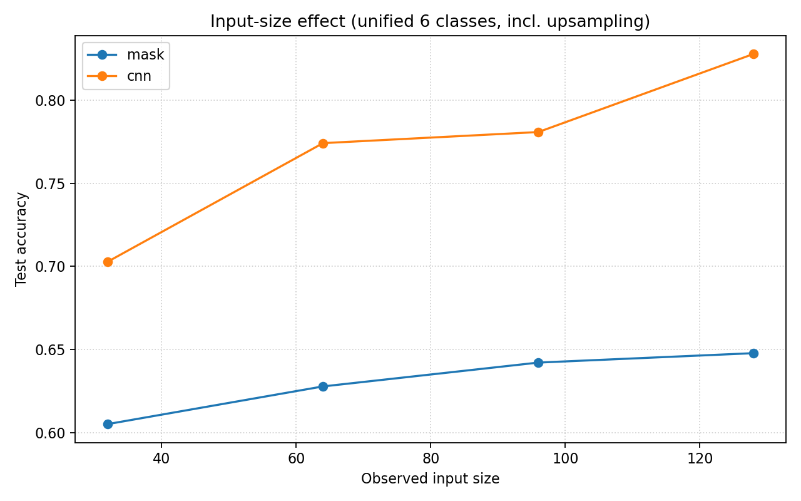

# n6 实验结果分析

> 协议：RAISE-1K · 6 类 · split `raise_split_seed123` · test 每类 1000（共 6000）  
> 方法：**Mask** vs **CNN** · 观测尺寸 32 / 64 / 96 / 128 px  
> **量纲**：除 `Size (px)` 外，指标均为 \[0, 1\]，三位小数（与 `metrics.json` 一致）

---

## 表格结构说明（为何拆成三张表）

| 表 | 对应章节 | 回答的问题 | 指标性质 |
|----|----------|------------|----------|
| **Table 1** | §1 Overall | 六类主任务做得怎样？ | 模型**原生输出**（Acc / F1） |
| **Table 2** | §2 Task 1 | JPEG 与几何重采样是否混淆？ | 由 CM **派生**的二分类 + 定向错误率 |
| **Table 3** | §3 Task 2 | 倍率/尺度能否推断？ | 由 CM **派生的子任务**准确率 |

Task 1/2 **不是独立实验**；Table 2–3 与 Table 1 共用同一次 test 的 confusion matrix，只是换了一个「读 CM 的角度」。后文引用时：**Overall 看表 1，机制解释看表 2–3**。

---

## 1. Overall Performance

### Table 1 — Six-class test results (native metrics)

| Method | Size | Acc | Macro F1 | Orig | JPEG | Dn×8 | Dn×16 | Up×4 | Up×8 |
|--------|------|-----|----------|------|------|------|-------|------|------|
| Mask | 32 | 0.605 | 0.592 | 0.339 | 0.589 | 0.331 | 0.457 | 0.923 | 0.914 |
| Mask | 64 | 0.628 | 0.605 | 0.374 | 0.624 | 0.218 | 0.545 | 0.923 | 0.949 |
| Mask | 96 | 0.642 | 0.618 | 0.383 | 0.638 | 0.234 | 0.563 | 0.928 | 0.959 |
| Mask | 128 | 0.648 | 0.620 | 0.378 | 0.629 | 0.234 | 0.596 | 0.926 | 0.957 |
| CNN | 32 | 0.703 | 0.695 | 0.688 | 0.730 | 0.433 | 0.407 | 0.964 | 0.949 |
| CNN | 64 | 0.774 | 0.746 | 0.815 | 0.853 | 0.234 | 0.645 | 0.975 | 0.951 |
| CNN | 96 | 0.781 | 0.774 | 0.818 | 0.843 | 0.472 | 0.587 | 0.956 | 0.969 |
| CNN | 128 | 0.828 | 0.825 | 0.929 | 0.913 | 0.517 | 0.653 | 0.977 | 0.958 |

随机基线：Acc **0.167**。



### 1.1 解读

- 128px：**CNN Acc 0.828 vs Mask 0.648**（Δ **+0.180**）；CNN 随尺寸增益更大（32→128：**+0.125** vs **+0.043**）。
- **Easy 列**（Up×4/Up×8）两类方法均 **>0.91**；**Hard 列**（Dn×8）Mask 仅 **0.218–0.234**。
- 路线 A（经典）未列入；补跑后可增行。

---

## 2. Task 1 — Distinguish JPEG from Resampling Classes

**科学问题**：JPEG 压缩伪影 vs 几何重采样痕迹，在频域是否仍混淆？

**读表方式**：不重复 Table 1 的 JPEG F1，而看 **JPEG 与四类几何之间的定向错误** 及 **五类子集上的二分类**。

### Table 2 — JPEG ↔ geometric resampling (derived from CM)

| Method | Size | JPEG↔Geom† | Orig→JPEG err | JPEG→Geom err | Geom→JPEG err | Geom-mean F1‡ |
|--------|------|-------------|---------------|---------------|---------------|---------------|
| Mask | 32 | 0.910 | 0.407 | 0.215 | 0.051 | 0.656 |
| Mask | 64 | 0.926 | 0.413 | 0.200 | 0.036 | 0.659 |
| Mask | 96 | 0.933 | 0.452 | 0.146 | 0.042 | 0.671 |
| Mask | 128 | 0.933 | 0.440 | 0.202 | 0.028 | 0.678 |
| CNN | 32 | 0.938 | 0.176 | 0.085 | 0.050 | 0.688 |
| CNN | 64 | 0.974 | 0.057 | 0.063 | 0.014 | 0.701 |
| CNN | 96 | 0.976 | 0.194 | 0.035 | 0.020 | 0.746 |
| CNN | 128 | 0.986 | 0.022 | 0.062 | 0.002 | 0.776 |

| 列 | 定义 |
|----|------|
| **JPEG↔Geom†** | 仅在真实标签 ∈ {JPEG, Dn×8, Dn×16, Up×4, Up×8} 的 5000 样本上，二分类「JPEG vs 任一几何类」的准确率 |
| **Orig→JPEG err** | 真实 Orig 被预测为 JPEG 的比例（解释 Mask 六类 Acc 低的主因） |
| **JPEG→Geom err** | 真实 JPEG 被预测为任一下/上采样类的比例 |
| **Geom→JPEG err** | 真实几何类被预测为 JPEG 的比例（四类几何样本平均） |
| **Geom-mean F1‡** | 四类几何 F1 的算术平均（便于与 JPEG 列对照，数值见 Table 1） |

### 2.1 解读

1. **JPEG↔Geom 很高（0.93–0.99）≠ 六类做得好**：Mask 的 Orig→JPEG err 仍达 **0.440**——大量原图被当成 JPEG。  
2. **CNN 同时压低三条错误率**：128px 上 Orig→JPEG **0.022**，JPEG→Geom **0.062**，Geom→JPEG **0.002**。  
3. **与 NFA 复现一致**：W3 上 JPEG 与 JPEG+重采样 NFA 曲线重合；learnable 模型在 **JPEG↔Geom 子空间** 内可分离，但 Mask 受限于 Fourier-only。  

**写作提示**：§2 引用 Table 2 全表；JPEG/Orig 单列 F1 仅回指 Table 1。

---

## 3. Task 2 — Infer Original Scale History

**科学问题**：在几何重采样内部，能否推断 **下采样倍率（×8 vs ×16）** 与 **上采样倍率（×4 vs ×8）**？

**读表方式**：Table 1 已给各类 F1；Table 3 专门给 **倍率二分类** 与 **定向混淆率**（F1 无法单独反映 ×8→×16 单向洪泛）。

### Table 3 — Scale / rate inference (derived from CM)

| Method | Size | Dn8↔Dn16 | Up4↔Up8 | Geom 4-class | Dn×8 recall | Dn×16 recall | ×8→×16 err |
|--------|------|----------|---------|--------------|-------------|--------------|------------|
| Mask | 32 | 0.396 | 0.944 | 0.670 | 0.296 | 0.496 | 0.391 |
| Mask | 64 | 0.421 | 0.955 | 0.688 | 0.165 | 0.677 | 0.567 |
| Mask | 96 | 0.429 | 0.958 | 0.693 | 0.168 | 0.690 | 0.547 |
| Mask | 128 | 0.469 | 0.965 | 0.717 | 0.167 | 0.771 | 0.578 |
| CNN | 32 | 0.387 | 0.950 | 0.668 | 0.432 | 0.341 | 0.305 |
| CNN | 64 | 0.484 | 0.976 | 0.730 | 0.147 | 0.821 | 0.698 |
| CNN | 96 | 0.512 | 0.981 | 0.747 | 0.420 | 0.605 | 0.451 |
| CNN | 128 | 0.594 | 0.983 | 0.788 | 0.447 | 0.741 | 0.523 |

| 列 | 定义 |
|----|------|
| **Dn8↔Dn16** | 仅在两类下采样样本上，×8 vs ×16 二分类准确率（随机基线 **0.500**） |
| **Up4↔Up8** | 仅在两类上采样样本上，×4 vs ×8 二分类准确率 |
| **Geom 4-class** | 仅在 4000 个几何重采样样本上的 4 类准确率 |
| **Dn×8 / Dn×16 recall** | 各类自身召回（= Table 1 该类 F1 的分母侧，直观展示漏检/误判） |
| **×8→×16 err** | 真实 Dn×8 被预测为 Dn×16 的比例（**核心混淆方向**） |

### 3.1 解读

1. **Dn8↔Dn16 全程最难**：Mask 最高 **0.469**，CNN 128px **0.594**，仍贴近随机；对应 NFA 受控实验 Top-1 尺寸 **0.111**。  
2. **Up4↔Up8 近饱和（>0.94）**：与 Table 1 中 Up 列 F1 一致，Task 2 的「简单一半」。  
3. **×8→×16 err 解释 Mask 低 Dn×8 F1**：128px 仍 **0.578**——超过半数 ×8 被判成 ×16；CNN 同指标 **0.523**，略好但仍高。  
4. **尺寸效应**：CNN 的 Dn8↔Dn16 从 0.387→0.594；更大 patch 必要但不充分。

**写作提示**：§3 引用 Table 3；Up/Dn 单列 F1 回指 Table 1。

---

## 4. Discussion

### 4.1 难度分层（128px，F1 见 Table 1）

| 层级 | 类别 | Mask | CNN | 机制（见表） |
|------|------|------|-----|------------|
| **Easy** | Up×4, Up×8 | 0.926, 0.957 | 0.977, 0.958 | Table 3：Up4↔Up8 **>0.98** |
| **Medium** | Orig, JPEG | 0.378, 0.629 | 0.929, 0.913 | Table 2：Mask Orig→JPEG **0.440** |
| **Hard** | Dn×8, Dn×16 | 0.234, 0.596 | 0.517, 0.653 | Table 3：Dn8↔Dn16 **0.469 / 0.594** |

### 4.2 方法对比（128px）

| | Mask | CNN |
|---|------|-----|
| 六类 Acc（表 1） | 0.648 | **0.828** |
| JPEG↔Geom（表 2） | 0.933 | **0.986** |
| Dn8↔Dn16（表 3） | 0.469 | **0.594** |
| 归纳偏置 | Fourier mask | 位置编码 + 卷积 |

### 4.3 与 NFA 复现

| 阶段 | 结论 |
|------|------|
| W3（10 RAISE） | PNG 重采样不可分 → 任务重定义 |
| 受控 4500 图 | 有峰 0.910，Top-1 尺寸 0.111 → Table 3 Hard |
| n6 learnable | 六类 0.60–0.83，但 Dn8↔Dn16 仍 ~0.5 |

### 4.4 局限

- 经典路线 A 未入表；单 seed。  
- 主文建议：**Table 1 放正文；Table 2–3 可放正文或附录**；128px 为主、32px 为尺寸敏感性。

---

## 附录：复现三表

```bash
# Table 1 原生指标
python scripts/analysis/summarize_size_effect.py

# Table 2–3：由 results/**/metrics.json 的 confusion_matrix 按上文列定义复算
```

原始文件：`results/{mask,cnn}/n6_*_size{N}/metrics.json`
